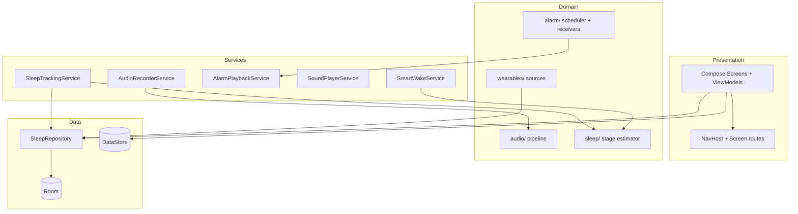

# Sleep Analyzer

An offline‑first Android sleep tracker built with Kotlin, Jetpack Compose, and Material 3. It tracks sleep from phone sensors and (optionally) a nightstand microphone, runs a smart cycle‑aware alarm, generates real sleep sounds procedurally, and keeps everything on device by default — with optional, opt‑in Firebase cloud sync.

- **Package / applicationId:** `tech.future.sleepanalyzer`
- **Min SDK:** 26 (Android 8.0) · **Target / Compile SDK:** 35 · **Version:** 1.0
- **Language / UI:** Kotlin 2.1 · Jetpack Compose (BOM 2024.12.01) · Material 3
- **Release APK:** ~3.38 MB under R8 (see [architecture §5.1](docs/architecture.md#51-release-apk-size-measured-under-r8))
- **Tests:** 17 JVM unit‑test suites, 103 cases, all green

> Wellness app, not a medical device. Sleep‑stage output is a heuristic estimate, not clinical polysomnography.

---

## Features

- **Home dashboard** — greeting, last‑night summary, weekly average score/duration, quality‑trend chart, quick actions.
- **Sleep tracking** — foreground service, accelerometer motion monitoring, 1–100 quality score, deep/light/REM/awake estimates, interruption counting, mood before/after.
- **Automatic bedtime detection** *(opt‑in)* — starts a session on its own after a sustained screen‑off + still + quiet window; conservative and reboot‑aware.
- **Microphone sleep staging (signal‑only)** *(opt‑in)* — feeds breathing/movement/snore signals into the estimator with **zero audio retention** (clips are never saved).
- **Smart alarm** — cycle‑aware wake window (0–90 min), exact `AlarmManager` scheduling, repeat days, snooze, boot rescheduling, full‑screen ringing UI.
- **Sleep recorder & snore tracker** — `AudioRecord` PCM pipeline, spectral snore/cough/talk/noise classification, optional "who's snoring?" voice attribution, on‑device playback.
- **Sleep sounds** — procedurally generated white/pink/brown noise, rain, ocean; volume + fade‑out sleep timer.
- **Statistics** — week/month/all‑time filters, trend + duration charts, best‑night / needs‑improvement highlights.
- **Health context insights** *(opt‑in)* — plain‑language notes from Health Connect caffeine/hydration/body‑temperature on the sleep report (informational, never fabricated score deltas).
- **Notes, goals, programs, alertness game** — tagged sleep notes, bedtime/wake goals, seeded 7‑day programs, morning reaction‑time test.
- **Privacy notice** — in‑app, plain‑language explanation of what stays local vs. what syncs, plus export/deletion guidance.

Full inventory: [`docs/features.md`](docs/features.md).

---

## Architecture

Layered, modular, and extensible — audio classifier, voice matcher, stage estimator, and wearable source are all swappable behind Strategy + Factory interfaces.



- **On‑device first:** Room + DataStore are the source of truth; no network is required. Raw audio and accelerometer data never leave the device.
- **Optional cloud:** Firebase Auth + Firestore sync are opt‑in and degrade gracefully when unconfigured.
- **Graceful degradation:** heart rate, HRV, SpO2, respiration, body temperature, voice profile, and user profile are all optional; every feature falls back to the data it has.

Deep dive (diagrams, threading model, audio pipeline, smart‑wake, persistence, permissions): [`docs/architecture.md`](docs/architecture.md).
Key decisions: [`docs/adr/`](docs/adr/README.md).

### Package map (`app/src/main/java/tech/future/sleepanalyzer/`)

| Package | Responsibility |
|---|---|
| `ui/` | Compose screens, ViewModels, navigation, theme |
| `service/` | Foreground services (tracking, recorder, alarm playback, sounds, smart wake, bedtime detect) |
| `audio/` | Capture pipeline, classification, sound generation, analysis |
| `sleep/` | Stage estimators, motion monitor, cycle predictor, smart‑wake analyzer, bedtime detector |
| `alarm/` | Scheduler + receivers (alarm, boot, smart alarm) |
| `wearables/` | Health Connect source, metrics, sync manager, health‑context insights |
| `data/` | Room entities/DAOs, repository, DataStore preferences |
| `auth/`, `sync/` | Optional Firebase auth + cloud sync |
| `di/`, `util/` | ServiceLocator (lazy singletons), permission helpers |

---

## Getting started

### Prerequisites

- **JDK 17** (required — the build targets JVM 17).
- Android SDK with **API 35**; a device or emulator on **API 26+**.
- Android Studio (Ladybug or newer) recommended, or the Gradle wrapper directly.

### Build & run

```bash
# Debug build
./gradlew assembleDebug          # gradlew.bat on Windows

# Install to a connected device/emulator
./gradlew installDebug

# Compile only (fast sanity check)
./gradlew compileDebugKotlin
```

If `JAVA_HOME` points at a non‑17 JDK, set it for the build, e.g. on Windows PowerShell:

```powershell
$env:JAVA_HOME = "C:\Program Files\Java\jdk-17.0.19"; $env:Path = "$env:JAVA_HOME\bin;$env:Path"
```

### Tests

```bash
./gradlew testDebugUnitTest      # 17 suites / 103 tests
```

### Release build (R8)

```bash
./gradlew assembleRelease        # ~3.38 MB unsigned APK (minify + resource shrink)
```

Release enables `isMinifyEnabled` and `isShrinkResources`; see [architecture §5.1](docs/architecture.md#51-release-apk-size-measured-under-r8).

---

## Optional: enable Firebase

Firebase (auth + cloud sync) is **off by default** so the app builds and runs in guest mode with no config. To enable it:

1. Create a Firebase project and register the Android app with applicationId `tech.future.sleepanalyzer`.
2. Drop the real `google-services.json` into `app/`.
3. Re‑add the Google Services plugin: `alias(libs.plugins.google.services)` in `app/build.gradle.kts` (it is intentionally commented out until a real config ships — see the note in that file).

The Firebase dependencies already compile via the BoM; `AuthRepository.isConfigured()` returns `false` and features degrade gracefully until the config is present.

---

## Privacy

Sleep Analyzer is **on‑device first**. Raw audio, accelerometer data, and on‑device stage estimation never leave the phone. Only when you sign in **and** opt into cloud sync do per‑night summaries sync to Firebase — **raw audio is never uploaded** ([ADR‑0005](docs/adr/0005-never-sync-raw-audio.md)). The in‑app notice (Settings → Privacy) explains what stays local, what syncs, the Health Connect read scope, and how to request export/deletion.

---

## Documentation

| Doc | Purpose |
|---|---|
| [`docs/features.md`](docs/features.md) | User‑facing feature inventory |
| [`docs/architecture.md`](docs/architecture.md) | Architecture, diagrams, design patterns, changelog |
| [`docs/adr/`](docs/adr/README.md) | Architecture Decision Records (0001–0006) |
| [`docs/backlog.md`](docs/backlog.md) | Intentionally deferred work + acceptance criteria |
| [`docs/issues.md`](docs/issues.md) | Review findings and their resolutions |

---

## License

No `LICENSE` file is currently included; treat the source as all‑rights‑reserved unless a license is added by the repository owner.
