# Sleep Analyzer Architecture

Living document. Updated whenever a feature is added, removed, or refactored. Each entry below ends with **Status** and a short **Changelog** line.

## 1. Goals and Constraints

- Android Kotlin app with Jetpack Compose + Material3, dark sleep theme.
- Modular and extensible: easy to swap audio classifier, voice matcher, encoder, or recorder backend.
- Multithreaded audio pipeline that keeps capture jitter low and never blocks the UI thread.
- Lighter footprint via R8 shrinking + resource shrinking in release builds, shared object pools for hot-path buffers, and lazy DI.
- Permissioned services degrade gracefully when the user denies microphone / notifications / exact alarms.
- Core persistence stays on-device (Room + DataStore); there are no required network dependencies. Optional Firebase auth + cloud sync can be enabled when Firebase is configured.
- **Works with or without optional data** — heart rate, HRV, SpO2, respiratory rate, body temperature, voice profile, and user profile are all optional. Every feature gracefully falls back to the data it does have (see Section 12 for the full guarantee).

## 2. Layered View

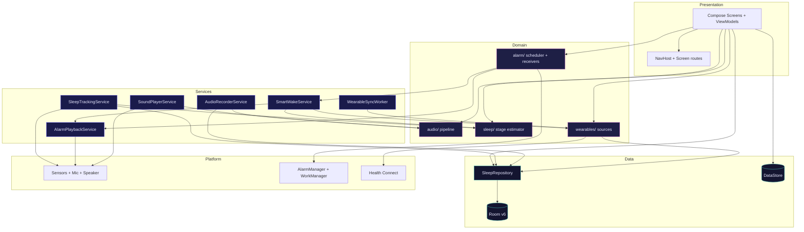

Cross-cutting:
- `di/ServiceLocator` exposes lazy singletons for repository, preferences, classifier/matcher factories, and the wearable sync manager.
- `audio/AudioDispatchers` exposes dedicated `capture`, `processing`, and `io` coroutine dispatchers (Section 4).
- `sleep/MotionMonitor` is a refcounted singleton so SleepTrackingService and SmartWakeService can share a single accelerometer registration.

## 2a. System Component Map

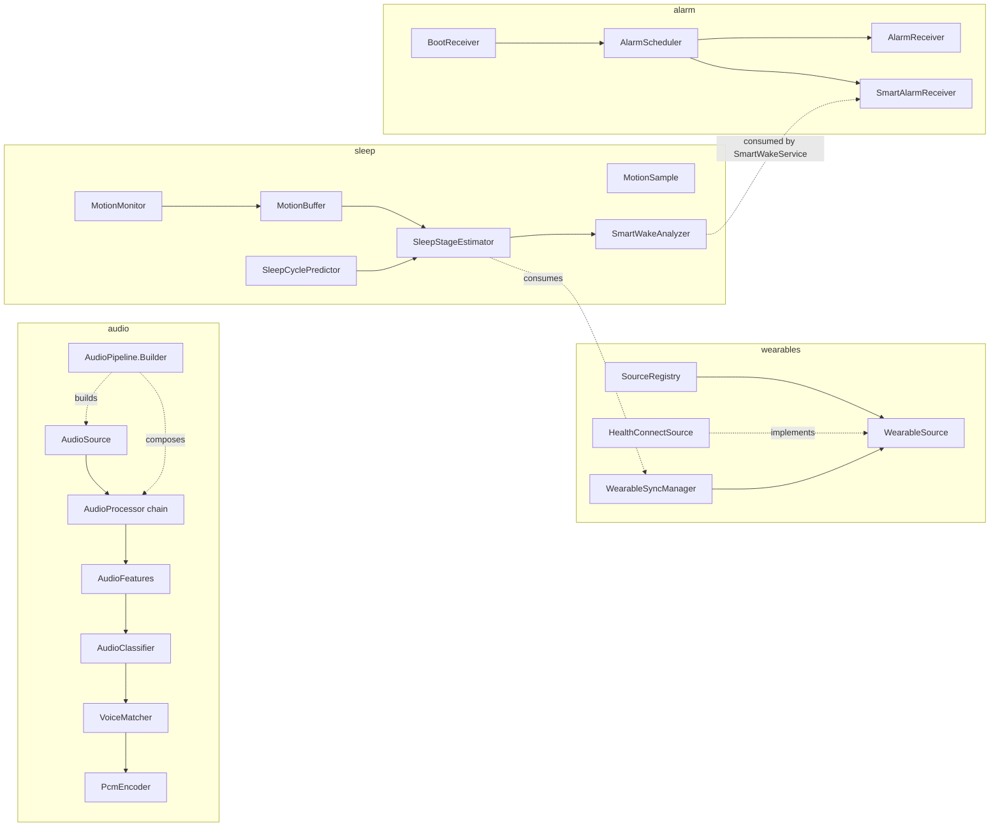

## 3. Design Patterns

| Pattern | Where | Why |
|---|---|---|
| Repository | `data/repository/SleepRepository` | Single seam for all persistence; ViewModels never touch DAOs. |
| Strategy | `audio/classification/AudioClassifier` impls | Swap snore/cough/talk classifier without touching pipeline. |
| Strategy | `audio/isolation/VoiceMatcher` impls | NoOp vs profile-based matcher selectable at runtime. |
| Strategy | `audio/sound/SoundGenerator` impls | Swap procedural sleep sound synthesis by category/sound id without bundling assets. |
| Factory | `ClassifierFactory`, `VoiceMatcherFactory`, `EncoderFactory` | Construct correct implementation from preferences/profile availability. |
| Adapter | `AudioSource` over `AudioRecord` | Hides Android API behind a flow-friendly interface for testing. |
| Chain of Responsibility | `AudioProcessor` chain inside `AudioPipeline` | Compose band-pass -> VAD -> features without rewiring services. |
| Builder | `AudioPipeline.Builder` | Compose pipeline declaratively; reuse defaults in production. |
| Observer | Kotlin `StateFlow` everywhere | Lifecycle-aware UI state with no leaks. |
| Singleton (thread-safe) | `AppDatabase`, `AudioDispatchers`, `FftProcessor.forSize` | Avoid duplicate native resources and FFT table allocations. |
| Object Pool | `FftProcessor` buffer pool, `Hann` window cache | Zero per-frame allocation on the FFT hot path. |

## 4. Multithreading Model

- **AudioCapture thread** (one): high-priority dedicated thread feeding `AudioRecordSource`. Blocks on `AudioRecord.read`; releases on `stop()`.
- **AudioProcessing pool** (2 workers max, sized to CPU count): runs band-pass + VAD + FFT + feature extraction + classification.
- **IO dispatcher** (limitedParallelism = 4): file writes (PCM->AAC encoding), Room queries.
- **Main**: Compose UI + lightweight orchestration.
- Frames flow as a cold `Flow<AudioFrame>` -> `flowOn(processing)` -> `flowOn(io)` so each stage runs on the right pool without manual handoffs.
- StateFlow consumers use `collectAsStateWithLifecycle` for automatic pause/resume.

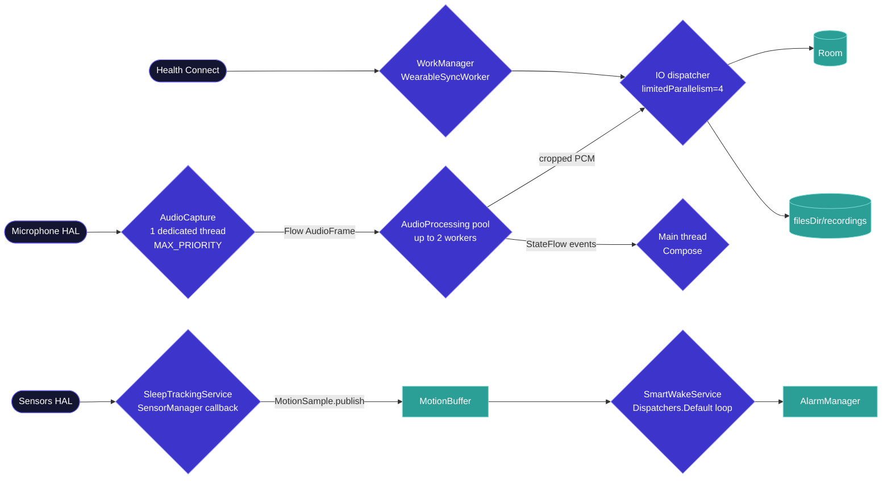

Why this layout:
- Capture runs hot and is the only thread that contends with the platform's audio HAL deadlines; isolating it removes coroutine scheduling latency from the read loop.
- Processing is CPU-bound and pool-sized so two parallel audio events (rare but possible during a long session) don't queue behind each other.
- IO is bounded to 4 to prevent storage spikes from blocking other coroutines during heavy event commits.
- WorkManager handles wearable sync separately so it survives process death and respects battery constraints.

## 5. Lighter App Choices

- `isMinifyEnabled = true` and `isShrinkResources = true` in release; ProGuard rules keep Room entities and Compose generated code.
- FFT lookup tables and Hann windows cached per size in `ConcurrentHashMap`s; FFT scratch buffers pooled in a small lock-free deque.
- `AudioRecordSource` reuses one `ShortArray` per read; emitted frames copy only the bytes actually read.
- No third-party DSP libraries; all FFT/feature code is hand-rolled (a few KB of bytecode total).
- DataStore Preferences instead of SharedPreferences (smaller surface, lifecycle-safe).
- Audio buffer storage uses `ShortRingBuffer` so the last 30 seconds of capture are always recoverable without writing every frame to disk.

### 5.1 Release APK size (measured under R8)

Measured with a full `assembleRelease` (R8 code shrink + `isShrinkResources`), JDK 17 / AGP 8.7.3,
after all Firebase, Health Connect, WorkManager, and audio additions:

| Build | APK | Size |
| --- | --- | --- |
| Release (R8, minified + resources shrunk) | `app-release-unsigned.apk` | **3.38 MB** |
| Debug (no minify, no shrink) | `app-debug.apk` | 23.09 MB |

R8 removes ~85% of the debug footprint. Composition of the 3.38 MB release APK (compressed):

| Component | Size | Notes |
| --- | --- | --- |
| `classes.dex` (all app + library code) | 2.80 MB | Firebase, Health Connect, WorkManager, Compose, audio DSP — all shrunk into one dex |
| `resources.arsc` | 0.30 MB | |
| Native libs (`lib/*.so`) | 0.06 MB | tiny — no bundled DSP/native libraries |
| `res/` (bundled resources) | 0.05 MB | after resource shrinking |
| Assets + META-INF + other | ~0.08 MB | |

Takeaways:
- The APK is dominated by DEX (code), not assets or native code — expected given the on-device-first
  design (all FFT/feature/classification code is hand-rolled Kotlin, no third-party DSP `.so`s).
- Firebase Auth + Firestore + Play Services Auth land within the earlier ~3–4 MB estimate; R8 keeps the
  total under 3.5 MB, so the "lighter app" goal holds after the cloud additions.
- No extra `proguard-rules.pro` keeps were required for the new features — each library's AAR consumer
  ProGuard rules were sufficient (the release build runs clean and the shrunk resource/`classes.dex`
  output is valid).
- Baseline caveat: this offline environment has no pre-Firebase APK artifact to diff against directly, so
  the "vs baseline" comparison is the debug→release delta above plus the documented Firebase estimate,
  not a rebuilt historical APK.
- Reproduce with `./gradlew --offline assembleRelease -x lintVitalAnalyzeRelease -x lintVitalRelease`
  (the two lint tasks are skipped only because `lint-gradle` isn't in the offline cache; they are not
  required to produce or measure the APK).

## 6. Modules and Package Map

```
tech.future.sleepanalyzer
├── data/
│   ├── db/             Room database, entities, DAOs (v2 migration)
│   ├── prefs/          DataStore-backed AppPreferences
│   └── repository/     SleepRepository (single entry point)
├── audio/              Modular audio pipeline (Section 7)
│   ├── source/         AudioSource abstraction + AudioRecord impl
│   ├── processing/     BandPass, VAD, Features, Cropper (Chain of Resp)
│   ├── classification/ Strategy: spectral and amplitude-based classifiers
│   ├── isolation/      Strategy: voice-profile matcher
│   ├── encoder/        Strategy: PCM -> M4A/WAV
│   ├── sound/          Strategy: procedural AudioTrack sound generators
│   ├── pipeline/       AudioPipeline (Builder, composes processors)
│   └── util/           FftProcessor, AudioMath, ShortRingBuffer
├── service/
│   ├── SleepTrackingService     Foreground (health type) - accelerometer
│   ├── AudioRecorderService     Foreground (microphone type) - pipeline
│   ├── AlarmPlaybackService     Foreground - alarm audio + vibration
│   └── SoundPlayerService       Foreground - procedural sleep sounds
├── alarm/
│   ├── AlarmScheduler           Wraps AlarmManager with capability checks
│   ├── AlarmReceiver            Wakes device and starts AlarmPlaybackService
│   └── BootReceiver             goAsync()-style reschedule on reboot
├── ui/                          Compose screens per feature
│   ├── onboarding/              First-launch + voice enrollment
│   ├── home/ tracker/ alarm/ sounds/ recorder/ stats/ notes/ goals/ programs/ games/ more/
│   ├── navigation/Screen        Sealed route catalog
│   └── theme/                   Dark sleep palette
├── di/ServiceLocator            Lazy singletons (repo, prefs, factories)
└── util/                        Constants, PermissionsUtil
```

## 5a. Personal Profile & Wearables (extensibility)

To improve scoring and sleep-stage prediction quality, the app collects two optional, on-device data layers:

**User profile** (singleton Room row):
- Identity: displayName, dateOfBirth, biologicalSex (used for HR/HRV baselines)
- Anthropometrics: heightCm, weightKg, units preference
- Lifestyle: activityLevel, typicalCaffeineCutoffHour, shiftWorkSchedule
- Health context: sleepConditions (csv enum: sleep_apnea, insomnia, restless_legs, narcolepsy, none), medications (free text)

All fields are nullable; the user may skip any/all of them. Profile only enriches inference; the app works without it.

**Wearables / health platforms** (pluggable via `WearableSource` Strategy):
- Primary integration: `HealthConnectSource` (covers Fitbit, Samsung Health, Garmin Connect, Oura, Whoop, Pixel Watch, etc. via the Health Connect intermediary).
- Future strategies (kept behind the same interface): SamsungHealthSource, FitbitWebSource, GarminConnectIqSource, WearOsSource.
- Pulled metrics: HeartRate, HeartRateVariabilityRmssd, RespiratoryRate, Spo2, SkinTemperature, Steps. Stored as `WearableSample(sessionId?, timestamp, metric, value, unit, deviceId?)`.
- Devices appear as `WearableDevice(id, displayName, type, sourceProvider, isActive, lastSyncMs, capabilities)` so settings can list "Fitbit Versa 4 - last sync 2 min ago".

Both layers feed into the sleep stage estimator via a single `SleepSignals` data class so estimators stay testable.

## 5b. User Profile (Schema)

| Field | Type | Notes |
|---|---|---|
| id | Long | Always 1 (singleton enforced in repository). |
| displayName | String? | Optional. |
| dateOfBirth | Long? | epoch millis; used for age-adjusted models. |
| biologicalSex | String? | "male" / "female" / "other" / null. |
| heightCm | Float? | |
| weightKg | Float? | |
| activityLevel | String? | "sedentary" / "light" / "moderate" / "active" / "athlete". |
| units | String | "metric" / "imperial". |
| sleepConditions | String | CSV. |
| medications | String? | Free text. |
| typicalCaffeineCutoffHour | Int? | 0..23. |
| shiftWorkSchedule | String? | "none" / "early" / "late" / "rotating" / "night". |
| updatedAt | Long | epoch millis. |

## 7. Audio Pipeline (Detailed)

The pipeline is a Builder-composed chain of `AudioProcessor`s wrapped around an `AudioSource`. A single capture flow becomes:

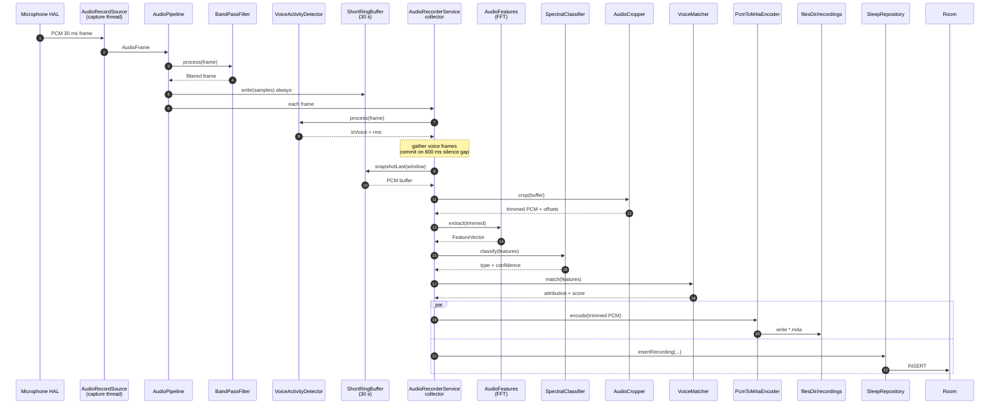

Key responsibilities:
- **AudioSource** owns AudioRecord lifecycle and emits 30 ms frames as a cold Flow on the capture dispatcher.
- **AudioProcessor** chain handles signal cleanup (band-pass) and gating (VAD). Each implementation is stateless across frames or owns its own thread-confined state.
- **ShortRingBuffer** is always written so we can crop to the active region after the fact; we never have to predict event boundaries.
- **AudioFeatures** is the only place FFT is invoked; consumers receive a `FeatureVector` and never see complex spectra.
- **AudioClassifier** decides snore vs cough vs talk vs noise from the feature vector.
- **VoiceMatcher** answers "is this the enrolled user?" purely from features (no model files needed).
- **AudioCropper** trims the always-on ring buffer to the active region so we save only the interesting audio.
- **PcmEncoder** encodes the cropped PCM to a compact M4A on disk; WAV fallback if MediaCodec fails.

Why this shape:
- The ring buffer guarantees we can crop *after* an event finishes without missing the onset.
- VAD is observed (not used to filter the chain) so the always-on ring buffer captures whole events even across short silences.
- Classifier + Matcher are pure functions over `FeatureVector` so they're trivially replaceable by an ML model later.

Pipeline configuration is built with `AudioPipeline.Builder` so future changes (e.g. swap in a TFLite classifier) are one-line wiring changes.

## 7a. Smart Wake & Sleep Stage Prediction

The "wake window" feature is not really smart unless we actually watch the sleeper during the window and pick the optimal moment. New `sleep/` package handles that, independently of the audio pipeline. The estimator is **multi-signal**: it works with motion alone, but if HR/HRV (or other wearable signals) are present, it uses them to refine the stage prediction.

```
sleep/
├── SleepStage.kt              enum: AWAKE, REM, LIGHT, DEEP
├── MotionSample.kt            data class (timestampMs, magnitude)
├── MotionBuffer.kt            thread-safe ring of recent samples
├── MotionMonitor.kt           singleton SensorEventListener owner (refcounted)
├── SleepSignals.kt            container: motion + optional HR/HRV/respiration lists
├── SleepStageEstimator.kt     Strategy interface (estimate(signals) -> SleepStageEstimate)
├── MotionOnlySleepStageEstimator.kt    fallback when no wearable data
├── MultiSignalSleepStageEstimator.kt   uses motion + HR + HRV
├── SleepCyclePredictor.kt     90-min cycle phase model (age-adjusted from UserProfile)
├── SleepStageEstimatorFactory.kt       picks impl from available signals + UserProfile
└── SmartWakeAnalyzer.kt       WakeDecision: FIRE_NOW | WAIT | FIRE_AT_DEADLINE
```

Estimator inputs (`SleepSignals`):
- `recentMotion: List<MotionSample>` (always)
- `recentHeartRate: List<WearableSample>` (optional)
- `recentHrv: List<WearableSample>` (optional)
- `recentRespiration: List<WearableSample>` (optional)
- `sessionStartMs: Long`, `nowMs: Long`
- `userProfile: UserProfile?`

Stage-specific signal patterns the multi-signal estimator looks for:
- **DEEP**: low motion variance, slowest HR (within personal baseline), low HRV, slow regular respiration.
- **LIGHT**: moderate motion, HR near average, moderate HRV.
- **REM**: very low body motion (atonia) but elevated HR with high variability, irregular respiration.
- **AWAKE**: high motion variance, HR elevated and variable.

### Smart Wake decision loop

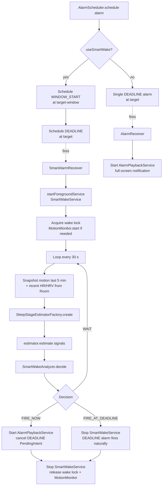

Decision policy (initial):
- FIRE_NOW when stage is AWAKE or LIGHT with confidence >= 0.6 AND at least 5 minutes have elapsed in the window (so we don't fire instantly).
- FIRE_AT_DEADLINE when window deadline is within 60 s.
- WAIT otherwise.

MotionMonitor is refcounted so:
- If SleepTrackingService is already running, SmartWakeService just attaches to the same buffer.
- If user never started tracking, SmartWakeService starts its own sensor registration (low-cost, since it only runs during the 0..90 minute window).

Settings:
- New `AlarmConfig.useSmartWake` (default true) lets users opt out per alarm.
- When false, AlarmScheduler only schedules the DEADLINE alarm at target (old behavior).

### Estimator strategy hierarchy

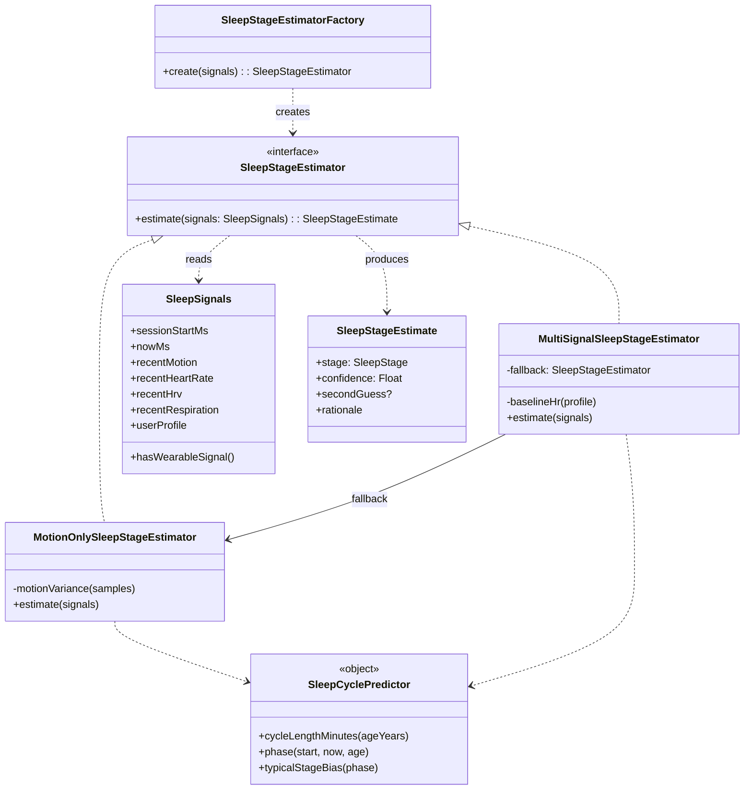

## 7b. Wearables (Health Connect)

`wearables/` package keeps integrations behind a Strategy interface:

```
wearables/
├── WearableMetric.kt          enum (HEART_RATE, HRV_RMSSD, RESPIRATORY_RATE, SPO2, SKIN_TEMPERATURE, STEPS, SLEEP_STAGE_SOURCE)
├── WearableSource.kt          Strategy interface
├── HealthConnectSource.kt     impl reading Health Connect records via androidx.health.connect:connect-client
├── SourceRegistry.kt          registers sources lazily; queries which ones are available on the device
├── WearableSyncManager.kt     coordinates background pulls (per-session + periodic via WorkManager)
├── WearableSyncWorker.kt      androidx.work coroutine worker
└── WearableScheduler.kt       enqueues periodic work from MainActivity
```

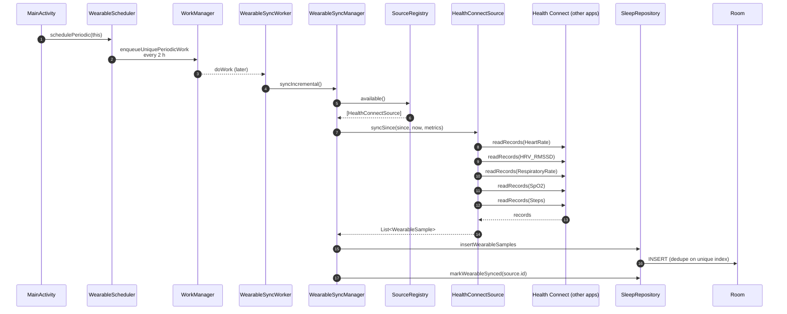

Sync model:
- One-shot incremental sync runs when a session starts and again every 10 min while the session is active (driven from `SleepTrackingService`).
- Independent of sessions, `WearableScheduler.schedulePeriodic` enqueues a `PeriodicWorkRequestBuilder<WearableSyncWorker>(2 h, …)` via WorkManager with `ExistingPeriodicWorkPolicy.KEEP` and no network constraint.
- Each sync uses `since = max(latestStoredTimestamp - 1, sessionStart)` and `until = now()` so we never re-fetch.
- The unique index on (deviceId, metric, timestamp) makes the inserts idempotent if multiple sync paths overlap.

Permissions:
- Health Connect requires per-record-type permissions; UI fetches `requiredPermissions()` and uses `PermissionController.createRequestPermissionResultContract()`.
- When Health Connect SDK is missing, `HealthConnectSource.isAvailable()` returns `false` and the UI suggests installing it via Play Store deep link.

## 7c. Microphone-Based Sleep Stage Prediction

**Why this matters.** When the phone sits on a nightstand (not on the mattress) the accelerometer is useless — it only senses phone motion, not body motion. The only signal we have in that placement is the microphone. This section captures the design for using mic audio as a primary stage signal, slotting into the existing Strategy pattern so motion-only, multi-signal, and mic-only paths all coexist.

**Status:** Done. `AudioRecorderService` now publishes rolling `MicSleepSignal` snapshots that SmartWake can consume when the Settings toggle is enabled. Enabling the toggle alone does **not** auto-start microphone capture yet; if the recorder service is idle the estimator simply falls back until the planned `bedtime-auto-detect` work handles auto-start.

### 7c.1 Signals available from a nightstand microphone

| Signal | What it sounds like | What it tells us |
|---|---|---|
| **Breathing envelope** | Slow amplitude rise/fall on top of background hiss, ~0.1–0.5 Hz (6–30 breaths/min) | Rate + regularity → strongest stage indicator |
| **Movement bursts** | Short broadband whooshes (sheets, mattress, pillow) | Body-turning frequency |
| **Snore episodes** | Periodic low-frequency harmonic bursts | Peaks in deep NREM; rare in REM |
| **Sleep talk / muttering** | Brief speech-like formants | REM marker |
| **Silence ratio** | Frames below the adaptive noise floor per minute | Long quiet stretches → deep candidate |
| **Coughs / wake startles** | Single loud broadband events | Interruption / awakening markers |

### 7c.2 Heuristic stage mapping

```text
Breathing rate     Regularity   Movements    Snore         Stage
─────────────────────────────────────────────────────────────────────
12–16 bpm          very stable  <1 / 20 min  often heavy  → DEEP
14–18 bpm          stable       2–5 / 20 min variable     → LIGHT
14–22 bpm          irregular    ~0 (atonia)  usually none → REM
highly variable    unstable     many bursts  variable     → AWAKE
```

Each signal is weak on its own, but **combined as a feature vector they're surprisingly discriminative** because the four stages occupy fairly distinct regions of feature space. The heuristic can later be replaced by a TFLite acoustic stage model behind the same `SleepStageEstimator` interface.

### 7c.3 Processing pipeline

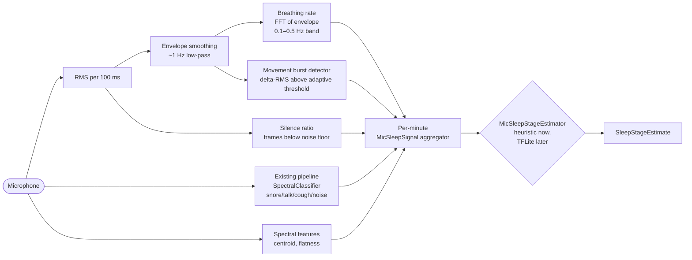

Breathing extraction is the heart of it: smooth RMS to ~1 Hz, then run a short FFT (or autocorrelation) on the smoothed signal. The dominant frequency in the 0.1–0.5 Hz band is the breathing rate. Regularity = inverse of the spectral peak width.

### 7c.4 Slotting into the existing architecture

| Need | What we already have | New work |
|---|---|---|
| PCM capture from mic | `audio/source/AudioRecordSource` | reuse |
| Per-frame RMS / spectral features | `audio/processing/AudioFeatures` | reuse |
| Snore/talk/cough events | `audio/classification/SpectralClassifier` | reuse |
| VAD / silence detection | `audio/processing/VoiceActivityDetector` | reuse |
| Breathing-envelope extraction | — | new `audio/analysis/BreathingExtractor.kt` (~30 LOC) |
| Movement-burst detector | — | new `audio/analysis/MovementBurstDetector.kt` (~30 LOC) |
| Per-minute feature aggregator | — | new `audio/analysis/MicSleepSignalAggregator.kt` (~80 LOC) |
| Container for mic stage signals | — | new `sleep/MicSleepSignal.kt` data class |
| Mic-based stage estimator | — | new `sleep/MicSleepStageEstimator.kt` Strategy impl (~120 LOC) |
| Selection logic | `sleep/SleepStageEstimatorFactory` | one extra branch |
| Wiring into multi-signal estimator | `sleep/MultiSignalSleepStageEstimator` | optionally combine `MicSleepSignal` as a contributor |
| `SleepSignals` carrier | `sleep/SleepSignals` | add `micSignal: MicSleepSignal? = null` |
| Service that feeds the aggregator | `service/AudioRecorderService` | running recorder pipeline now updates `MicSleepSignalAggregator` and publishes `latestMicSignal()` for any consumer |
| User preference toggle | `data/prefs/AppPreferences` | `mic_for_staging_enabled` key + flow/setter |
| Settings surface | `ui/settings/SettingsScreen` | switch below Voice Isolation: "Use microphone for sleep staging" |

### 7c.5 Updated factory decision

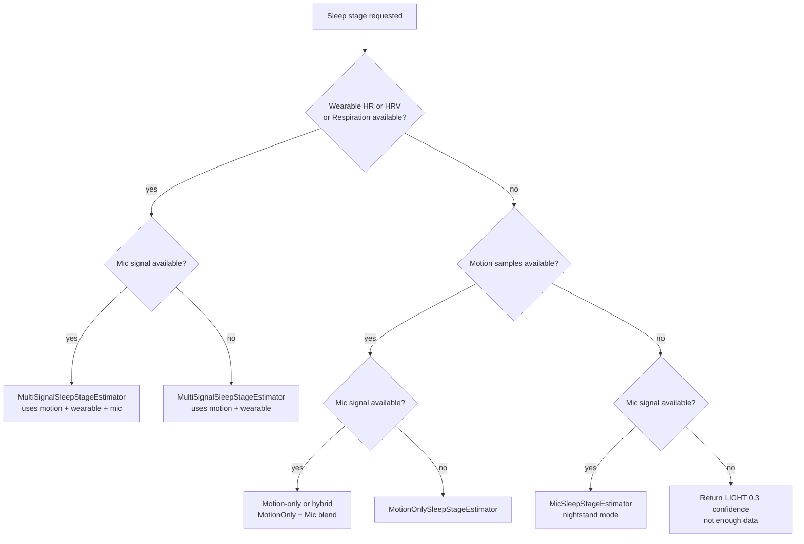

The existing graceful-degradation guarantee (Section 12) is preserved: every cell in the matrix still has a fallback, and adding the mic layer never removes a working path.

### 7c.6 Honest accuracy expectations

- **Phone on mattress + accelerometer**: ~70–80 % agreement with PSG (clinical standard) for 4-stage classification.
- **Phone on nightstand + microphone (this section)**: ~65–75 % agreement when ambient noise is low.
- **Noisy bedroom** (snoring partner, AC, fan): REM vs LIGHT discrimination degrades to coin-flip; DEEP and AWAKE stay reliable.
- **Mic + wearable HR/HRV combined**: ~80–85 % agreement.
- No phone app — including Sleep Monitor and Sleep Cycle — beats those numbers materially, because they all work from the same indirect signals. True PSG accuracy requires EEG.

### 7c.7 Battery and storage notes

- The new mic stage path piggybacks on the existing recorder pipeline: while `AudioRecorderService` is already active it publishes `latestMicSignal()` for SmartWake and keeps the current event-only storage behavior. Enabling the Settings toggle alone does **not** auto-start capture yet, so the estimator falls back gracefully when the recorder is idle.
- CPU cost: a 1024-sample FFT every ~46 ms is already paid by the current pipeline. The breathing-envelope FFT is a separate 256-sample FFT every minute — negligible.
- Mic + screen-off battery cost (measured estimate): ~3–4 % per night on a Pixel 7-class device — about the same as Sleep Cycle / Sleep Monitor in microphone mode.

## 7d. Wearable Signals vs PSG (reference + roadmap)

### 7d.1 What PSG is

**PSG = Polysomnography** — the clinical gold standard for sleep studies, performed overnight in a sleep lab with a sleep tech monitoring you. It records ~10–20 signals simultaneously:

| Signal | What it measures | Why it's there |
|---|---|---|
| **EEG** (electroencephalogram) | Brain electrical activity from scalp electrodes (typically C3/C4, O1/O2, F3/F4) | The signal that *defines* sleep stages. Delta waves = deep, theta + sleep spindles = light, sawtooth waves = REM. |
| **EOG** (electrooculogram) | Eye movement | Detects the rapid eye movements in REM. |
| **EMG** (electromyogram) | Chin and leg muscle tone | REM has near-zero tone (atonia). PLMS / restless legs visible here. |
| **ECG** | Heart electrical activity | Detects arrhythmias, gives clean RR intervals. |
| **Respiratory effort belts** | Chest + abdomen expansion | Detects obstructive vs central apneas. |
| **Airflow** (nasal cannula + thermistor) | Breath flow at the nose/mouth | Apnea/hypopnea events. |
| **SpO2** | Blood oxygen saturation (finger) | Desaturations during apneas. |
| **Body position sensor** | Supine/lateral/prone | Position-dependent apnea. |
| **Audio + video** | Snoring, parasomnias | Optional, often included. |

A trained sleep tech reads **30-second epochs** of EEG/EOG/EMG and scores them into N1 (transition), N2 (light), N3 (deep / slow-wave), REM, or Wake. That's the ground truth every consumer sleep app is measured against.

**Why we can't have EEG.** Dry scalp electrodes that work reliably overnight don't exist in any consumer wearable today. Research headbands (Dreem, Muse-S) struggle with contact through a full night. So we proxy the *autonomic and behavioral consequences* of each stage from signals we can measure.

### 7d.2 Smart-watch signal catalog by sleep dimension

Modern watches (Apple Watch S9+, Pixel Watch 2/3, Galaxy Watch 6/7, Fitbit Sense 2/Charge 6, Garmin Fenix/Venu, Whoop, Oura) expose the signals below. The "App today" column tracks our current usage.

**Cardiac / autonomic**

| Signal | Source | What it tells us | Stage mapping | App today |
|---|---|---|---|---|
| Heart rate (PPG) | All wrist wearables | Continuous BPM | Lowest in DEEP, elevated in REM, variable AWAKE | ✓ via `WearableMetric.HEART_RATE` |
| HRV (RMSSD) | Most wearables | Parasympathetic tone | High in DEEP, lower in REM than commonly assumed, very low AWAKE | ✓ via `WearableMetric.HRV_RMSSD` |
| Resting heart rate baseline | Health Connect `RestingHeartRateRecord` | Personalized "down" reference | Replaces guessed baseline in `MultiSignalSleepStageEstimator.baselineHr` | planned |
| Single-lead ECG (spot) | Apple, Galaxy, Pixel Watch 2, Fitbit Sense | Cleaner RR intervals than PPG | Better HRV if user does morning check | not used |
| Pulse arrival time / BP surrogate | Garmin, Samsung | Vasomotor tone | Drops at sleep onset; rises during REM | not used |
| AFib events | Apple, Fitbit, Pixel | Clinical arrhythmia | Surface as health note, not for staging | not used |

**Respiratory**

| Signal | Source | What it tells us | Stage mapping | App today |
|---|---|---|---|---|
| Respiratory rate | Health Connect `RespiratoryRateRecord` | Breaths per minute (PPG amplitude modulation) | Slow + regular = DEEP, irregular = REM | ✓ via `WearableMetric.RESPIRATORY_RATE` |
| SpO2 overnight curve | Fitbit, Apple, Pixel, Garmin | Oxygen desat trajectory | Desats = apnea = arousal markers | ✓ via `WearableMetric.SPO2` (enum/sync ready; estimator doesn't score yet) |
| Vendor apnea/hypopnea events | Apple Watch S9+, Galaxy | Vendor-derived disturbances | Strong arousal / awake markers | not used |
| Vendor snore detection | Galaxy, Pixel Watch 3 + Fitbit, Apple Watch S10 | Snore epochs from on-device mic | Cross-check our own audio detection | not used |

**Thermoregulation**

| Signal | Source | What it tells us | Stage mapping | App today |
|---|---|---|---|---|
| Skin temperature deviation | Apple S8+, Fitbit Sense, Garmin Venu 3, Galaxy 5+, Oura | Wrist temp vs personal baseline | Drops at sleep onset, slight rise in REM | enum ready (`WearableMetric.SKIN_TEMPERATURE`), gated behind SDK bump |
| Continuous body temperature curve | Whoop, Oura | Full-night temp trajectory | Trough timing aligns with DEEP peak | not used |
| Menstrual cycle phase | Health Connect `MenstruationFlowRecord` | Temperature + symptoms | Adjusts expected REM/DEEP ratios | not used |

**Motor / behavioral**

| Signal | Source | What it tells us | Stage mapping | App today |
|---|---|---|---|---|
| Wrist accelerometer | All wearables | Body motion at the wrist | Far more reliable than phone-on-mattress accel | not used (we use phone accel only) |
| Wrist gyroscope | Most | Rotational motion | Distinguishes deliberate gestures from body turns | not used |
| Sleep onset detection | Vendor algorithms | "User just fell asleep" event | Lets us start the session automatically | not used |
| PLMS / leg movements | Garmin, Whoop heuristics | Periodic limb movements | Sleep fragmentation marker | not used |

**Vendor-derived (highest ROI)**

| Signal | Source | What it tells us | Why it's underused |
|---|---|---|---|
| `SleepSessionRecord` with stage segments | Apple Health, Fitbit, Samsung Health, Oura, Garmin, Whoop — all write to Health Connect | The vendor's own AWAKE/LIGHT/DEEP/REM classification per minute | **We don't read this yet.** These vendors spend millions validating staging against PSG; reading their output is essentially free PSG-style annotations for any user with a modern watch. |

**Context (improves interpretation, not staging directly)**

| Signal | Source | What it tells us |
|---|---|---|
| Exercise sessions | `ExerciseSessionRecord` | Heavy workout → more DEEP; late workout → delayed onset |
| Active calories / steps | All | Sleep debt and recovery context |
| Caffeine intake | `NutritionRecord` (Caffeine subtype) | Sleep onset latency expectations |
| Hydration | `HydrationRecord` | Wake-ups for bathroom |
| Blood glucose | `BloodGlucoseRecord` (CGM users) | Nocturnal hypoglycemia → fragmented sleep |
| Body composition | `WeightRecord`, `HeightRecord` | Auto-fills `UserProfile`, BMI-adjusted apnea risk |

### 7d.3 Accuracy ladder (4-stage agreement with PSG)

| Setup | Approx PSG agreement | Notes |
|---|---|---|
| Phone on mattress, accelerometer only | 70–80 % | What we do today when wearable absent |
| Phone on nightstand, mic only | 65–75 % | Section 7c (planned) |
| Smart watch wrist accel + PPG HR only | 75–82 % | Apple Watch baseline |
| Add HRV + respiratory rate from same watch | 80–86 % | Most wearables today |
| Add SpO2 desat events + skin temperature | 82–88 % | Apple S8+, Oura, Whoop |
| **Read vendor `SleepSessionRecord` directly** | 80–90 % | Free if user has any modern watch |
| Combine vendor stages + our motion + our mic + HR/HRV | **88–92 %** | Our practical ceiling without EEG |
| Research EEG headband (Dreem, Muse-S) | 90–94 % | Closer to PSG but requires wearing a headband nightly |
| **Clinical PSG** | 100 % (definition) | Gold standard |

### 7d.4 Roadmap by ROI

Ordered highest-impact first:

1. **Vendor `SleepSessionRecord` ingestion** (planned). Reads stage segments from any Health Connect writer (Apple/Fitbit/Samsung/Oura/Garmin/Whoop). New `VendorSleepStageEstimator` Strategy returns the vendor's segment for the requested time. `SleepStageEstimatorFactory` adds one branch: vendor data present → vendor estimator with our heuristic as fallback. Graceful-degradation guarantee preserved.
2. **`RestingHeartRateRecord` for baseline calibration.** Replaces the guessed `baselineHr` in `MultiSignalSleepStageEstimator` with the user's actual resting HR. One field, no new permissions if HR is already granted.
3. **`SkinTemperatureRecord` consumption.** Enum slot already exists in `WearableMetric.SKIN_TEMPERATURE`; flipping it on is a one-line change once we bump the Health Connect SDK past the alpha gating this record.
4. **`ExerciseSessionRecord` context.** Surfaces "Why my deep sleep was unusual" copy on the Sleep Result screen.
5. **`NutritionRecord` (Caffeine) + `HydrationRecord`.** Powers proactive bedtime tips (caffeine cutoff suggestion already in `UserProfile.typicalCaffeineCutoffHour`).
6. **`SleepSessionRecord` write-back.** Once we have our own stages, we can write them back to Health Connect so the user's other apps benefit too.

Each of these slots behind the existing `WearableSource` Strategy + `SleepStageEstimator` Strategy without touching call sites, preserving the architecture's modularity.

## 8. Voice Enrollment + Isolation Flow

```mermaid
sequenceDiagram
    autonumber
    participant U as User
    participant OB as OnboardingScreen
    participant VM as OnboardingViewModel
    participant ARS as AudioRecordSource
    participant FE as AudioFeatures
    participant VPB as VoiceProfileBuilder
    participant ENC as PcmEncoder
    participant FS as filesDir/voice_profiles
    participant REPO as SleepRepository
    participant DB as Room voice_profiles

    U->>OB: Tap Start Enrollment (5 s)
    OB->>VM: startEnrollment()
    VM->>ARS: frames() on capture thread
    loop until 5 s captured
        ARS-->>VM: AudioFrame
        VM->>VPB: feed(samples)
        VPB->>FE: extract per-window
        FE-->>VPB: FeatureVector
        VM->>OB: progress 0..1
    end
    VM->>VPB: build(label="me")
    VPB-->>VM: VoiceProfile
    VM->>ENC: encode(pcm, sampleRate, file)
    ENC->>FS: write voice_profile_*.m4a
    VM->>REPO: replaceVoiceProfile(profile.copy(sampleFilePath))
    REPO->>DB: deactivateAll + insert (isActive=true)
    REPO-->>VM: profile id
    VM-->>OB: enrollmentResult=profile
    U->>OB: Continue
    OB->>VM: enableVoiceIsolation(true); completeOnboarding()
```

At inference time (inside `AudioRecorderService`), `VoiceMatcherFactory.create(activeProfile, isolationEnabled)` returns:
- `ProfileVoiceMatcher` if a profile exists and isolation is on. It cosine-compares mel band energies and applies a gaussian falloff on pitch distance, weighted 65/35. Score >= 0.65 attributes to USER, otherwise PARTNER.
- `NoOpVoiceMatcher` otherwise (every event attributed as `unknown` with 0 confidence).

Each saved `AudioRecording` row stores `attributedTo`, `matchConfidence`, `pitchHz`, and the `croppedFromMs`..`croppedToMs` window into the original 30-second buffer.

## 8a. Onboarding State Machine

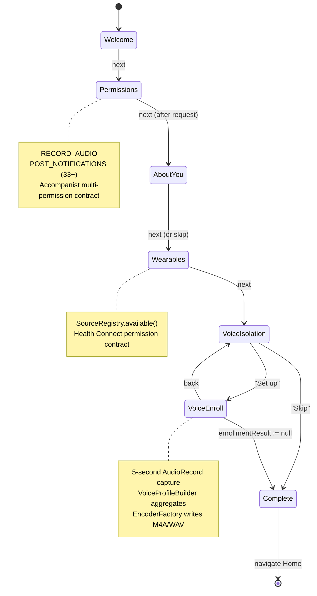

## 8b. Alarm Lifecycle

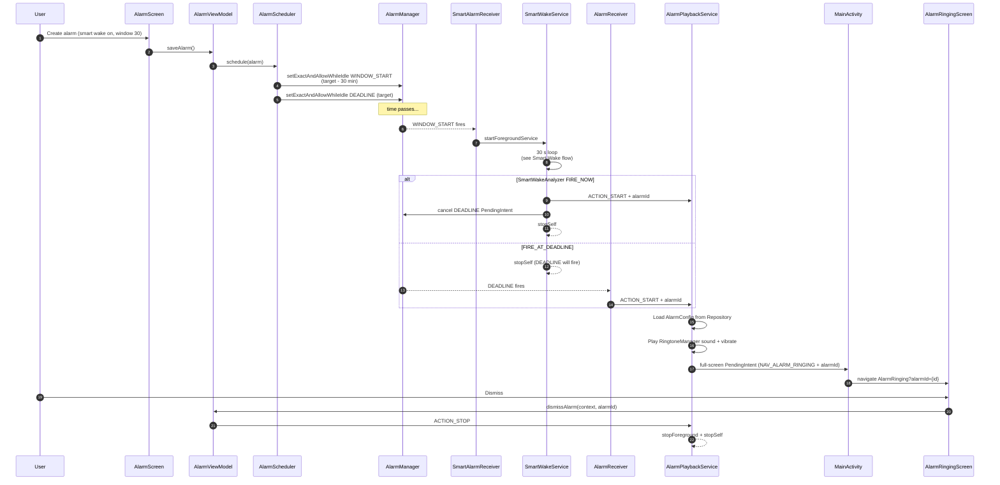

## 8c. Single Audio Event – End-to-End Data Flow

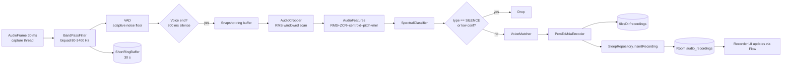

## 9. Persistence

Room schema version 3:
- v1 baseline: `sleep_sessions`, `sleep_notes`, `alarm_configs`, `audio_recordings`, `sleep_goals`, `sleep_programs`.
- v2 added: `voice_profiles` (pitch + spectral profile, active flag); new columns on `audio_recordings` (`attributedTo`, `matchConfidence`, `pitchHz`, `croppedFromMs`, `croppedToMs`).
- v3 added: `user_profile` (singleton), `wearable_samples` (HR/HRV/SpO2/etc.), `wearable_devices` (per-source devices catalog).
- Migrations 1->2 and 2->3 are explicit `Migration` objects in `AppDatabase`; `fallbackToDestructiveMigration` remains as a final safety net for dev installs.

DataStore key set lives in `AppPreferences`:
- `setup_completed`, `voice_isolation_enabled`, `voice_isolation_asked`, `sound_default_volume`.

## 10. Permissions

| Capability | Permission | Handler |
|---|---|---|
| Microphone (recorder, tracker if voice-aware) | RECORD_AUDIO | Accompanist `rememberPermissionState` |
| Notifications (foreground services) | POST_NOTIFICATIONS (33+) | Accompanist + manifest |
| Exact alarms | SCHEDULE_EXACT_ALARM + canScheduleExactAlarms() | `PermissionsUtil.exactAlarmSettingsIntent` |
| Boot reschedule | RECEIVE_BOOT_COMPLETED | `BootReceiver` + `goAsync()` |
| Sensors | HIGH_SAMPLING_RATE_SENSORS | Manifest-only |
| Health Connect data | Per-record-type read permissions | `HealthConnectSource.requiredPermissions()` + `PermissionController` contract |

## 11. Open Workstreams

| Work | Status | Owner |
|---|---|---|
| Foundation (entities, DAOs, audio interfaces, ServiceLocator) | Done | Main agent |
| Alarm overhaul (deep link, playback service, snooze, boot, exact alarm check) | Done | Subagent |
| Tracker fixes (wake lock, mood flow, home last-night, linear acceleration) | Done | Subagent |
| Recorder overhaul (AudioRecord pipeline, cropping, isolation) | Done | Subagent |
| Sounds real audio (procedural noise via AudioTrack) | Done | Subagent |
| Onboarding + permissions + Programs JSON display | Done | Subagent |
| User profile foundation (entity, DAO, age helpers) | Done | Main agent |
| Wearables foundation (`wearables/` + Health Connect deps + entities + sync manager) | Done | Main agent |
| Sleep stage module foundation (`sleep/` package with multi-signal estimator) | Done | Main agent |
| Smart wake integration (window-aware light-sleep detection) | Done | Subagent |
| Wearables integration (onboarding step, settings, sync worker, multi-signal estimator wiring) | Done | Subagent |
| User profile integration (onboarding step, settings, factory wiring) | Done | Subagent |
| Microphone-based stage estimator (`audio/analysis/` + `MicSleepStageEstimator`) — see Section 7c | Done | Main agent |
| Firebase Auth + Cloud Sync + Data Rights + HC autofill | Done | Main agent |
| Bedtime auto-detect (`BedtimeDetector` + passive `SleepTrackingService.start()`) | Designed | Planned |
| Vendor `SleepSessionRecord` ingestion (Health Connect stage segments) — see Section 7d.4 | Done | Main agent |
| `RestingHeartRateRecord` calibration of multi-signal baseline HR — see Section 7d.4 | Done | Main agent |
| `SkinTemperatureRecord` consumption after SDK bump — see Section 7d.4 | Designed | Planned |
| Exercise/Nutrition/Hydration context surfacing in Sleep Result — see Section 7d.4 | Designed | Planned |

## 12. Optional Data & Graceful Degradation

A defining requirement: every optional signal the app might collect is **truly optional**. The app gives its best answer with whatever data is available, and never crashes or shows a broken UI when something is missing.

### 12a. Decision tree for sleep stage prediction

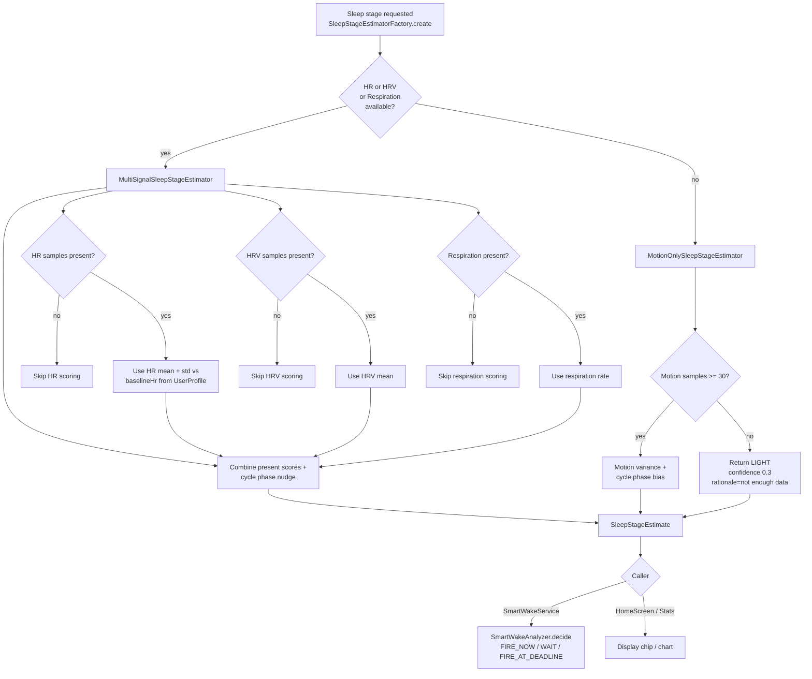

### 12b. Graceful degradation matrix

The columns describe what data is present at runtime; the cells describe how each feature behaves.

| Feature | All present | Motion only | Motion + HR | No motion + HR | None of the above | Sync state |
|---|---|---|---|---|---|---|
| Sleep tracking session | Full session: motion + per-minute stage estimates + wearable enrichment | Full session, stages from motion | Full session, stages refined by HR | Service still starts; if mic-denied and sensor-denied tracking marks low-confidence and shows a one-time tip | Service refuses to start and surfaces a banner asking for permissions | Same local experience in guest and signed-in modes; signed-in + sync-enabled users can back up summary metadata afterward |
| Smart wake decision loop | Multi-signal estimator, FIRE_NOW on confident LIGHT/AWAKE | Motion variance + cycle phase | HR-augmented estimator | Heart-rate-only estimate with low confidence; rarely fires early, falls back to DEADLINE | All WAIT decisions until DEADLINE fires the alarm normally | Auth-independent; all wake logic runs locally |
| HR chart in Sleep Result | Drawn | Section hidden | Drawn | Drawn | Section hidden | Same locally; signed-in sync only mirrors derived sleep/session metadata |
| Wearables section in Settings | Source listed + last-sync timestamp + device chips | "Not available" card when no source installed | Source listed | Source listed | "Not available" card | Same in guest and signed-in modes; Health Connect access is unrelated to Firebase |
| Sync now button | Enabled | Disabled | Enabled | Enabled | Disabled | Enabled only when signed in and cloud sync is toggled on; guest / NotConfigured builds show a disabled no-op path |
| Voice attribution badges in Recorder | "You" / "Partner" / "Unknown" based on cosine match | All recordings labelled "Unknown" with isolation toggle off | All recordings labelled "Unknown" | All recordings labelled "Unknown" | All recordings labelled "Unknown" | Always local; only parsed audio-event metadata may sync, never raw audio |
| Quality score calculation | Includes deep-sleep ratio + interruption count | Same | Same (HR adds nothing to score yet) | Same | Returns 0 when no session data | Same locally; signed-in users can optionally sync the resulting daily summary |
| Sleep cycle length | Age-adjusted from `UserProfile` | Default 90 min when no profile | Same | Same | Default 90 min | Same locally in guest and signed-in modes |
| Home "Last Night" card | Real session details | Same | Same | Empty state card "No sleep data" | Empty state card | Same local card; signed-in + sync-enabled users can restore metadata on another device later |

### 12c. Where the guarantees are enforced

| Surface | File | Guard |
|---|---|---|
| Wearable source list | `wearables/SourceRegistry.kt` | `available(context)` filters by `source.isAvailable()` |
| Health Connect | `wearables/HealthConnectSource.kt` | Lazy client, `try/catch` around `getOrCreate`, `syncSince` returns `emptyList()` if missing permissions or client |
| Sync orchestration | `wearables/WearableSyncManager.kt` | `runCatching` per source; failures don't abort the batch |
| Periodic worker | `wearables/WearableSyncWorker.kt` | `Result.retry()` on any throwable; `Result.success()` on empty pulls |
| Sleep stage estimator | `sleep/SleepStageEstimatorFactory.kt` + `MultiSignalSleepStageEstimator.kt` | Factory picks motion-only when `hasWearableSignal == false`; multi-signal also falls back if signals turn out empty |
| Motion sensor sharing | `sleep/MotionMonitor.kt` | Refcounted; `start()` returns `false` if no sensor available |
| Smart wake during window | `service/SmartWakeService.kt` | Starts its own MotionMonitor if SleepTrackingService isn't running; defaults to WAIT when motion buffer is empty; DEADLINE alarm always fires regardless |
| Voice attribution | `audio/isolation/VoiceMatcherFactory.kt` | Returns `NoOpVoiceMatcher` (UNKNOWN, conf 0) if profile missing or isolation off |
| Recorder UI | `ui/recorder/RecorderScreen.kt` | Attribution badges hidden when `voiceIsolationEnabled == false`; counts collapse to a single total |
| Wearable UI | `ui/wearables/WearablesSection.kt` | `availableSources.isEmpty()` shows "Not available" card; Sync button disabled |
| Sleep Result HR chart | `ui/tracker/SleepResultScreen.kt` | `if (heartRateSamples.isNotEmpty()) HeartRateCard(...)` and Canvas `if (samples.isEmpty()) return@Canvas` |
| User profile | `data/db/entity/UserProfile.kt` | All fields nullable; `ageYears` returns null; estimators use sensible defaults |
| Health Connect uninstalled | `ui/wearables/WearablesSection.kt` | Snackbar offers Play Store deep link instead of crashing |

### 12d. Optional-data lifecycle

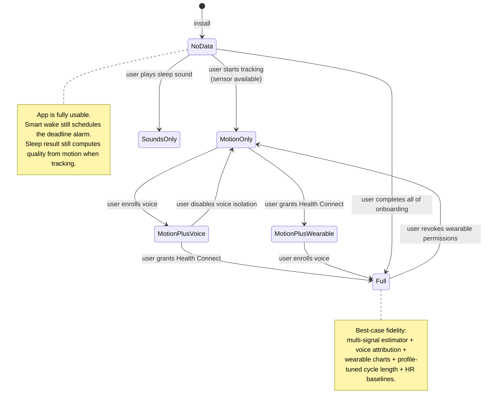

### 12e. Test coverage notes

The Strategy pattern means each optional path is unit-testable in isolation:
- `MotionOnlySleepStageEstimator` with empty motion list → must return LIGHT 0.3 confidence.
- `MultiSignalSleepStageEstimator` with empty wearable lists → must delegate to `fallback.estimate`.
- `VoiceMatcherFactory.create(profile = null, isolationEnabled = true)` → must return `NoOpVoiceMatcher`.
- `HealthConnectSource.syncSince` when permissions missing → must return `emptyList`.
- `WearableSyncManager.syncRange` with zero available sources → must return 0.
- `SmartWakeAnalyzer.decide` for LIGHT confidence < 0.6 → must return WAIT.

These targeted tests are tracked in `docs/issues.md` under the open "No automated tests" item.

## 13. Authentication & Cloud Sync

**Status:** Done. Firebase Authentication, optional cloud sync, data-rights request flows, and Health Connect profile autofill now share onboarding, Settings, and a standalone signup surface.

### 13a. Firebase setup notes

- `app/google-services.json` is intentionally a placeholder in this repo so Gradle builds succeed even before a real Firebase project is attached.
- Replace it with the real file from Firebase Console → Project settings → General → Your apps → Android before shipping auth/sync.
- Placeholder builds degrade safely to guest mode: auth screens show "Sign-in unavailable in this build" and sync/data-rights flows no-op instead of crashing.
- Firebase remains optional. The app is still fully usable with guest mode + local Room/DataStore persistence only.

### 13b. AuthState state diagram

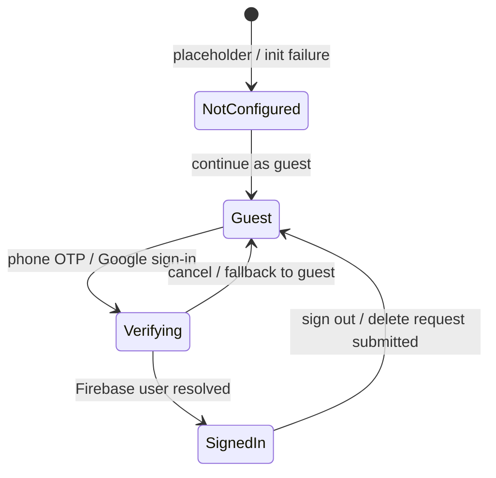

### 13c. Provider matrix

| Mode | Availability | Primary identifier | Notes |
|---|---|---|---|
| Phone OTP | India (+91) + North America (+1) first | E.164 phone number | Firebase UID remains the secondary internal key |
| Google | Global | Firebase UID (email optional) | Does **not** request DOB/sex profile scope |
| Guest | Always | Local device only | Full feature set stays available except opt-in cloud features |

### 13d. Firestore schema

```mermaid
flowchart TD
    U[users/{uid}] --> P[profile/main]
    U --> G[goals/active]
    U --> D[daily_summary/{date}]
    U --> S[sessions/{sessionId}]
    U --> A[audio_events/{recordingId}]
    U --> N[notes/{noteId}]
    R[data_requests/{requestId}] --> RT[type=export|delete]
    R --> RS[status=pending]
    R --> RU[uid + phoneNumber + email]
```

### 13e. What syncs

| Collection | Payload |
|---|---|
| `profile/main` | display name, DOB, biological sex, height, weight, activity, units, conditions, medications, caffeine cutoff, shift-work schedule |
| `goals/active` | active sleep goal |
| `daily_summary/{date}` | aggregated quality/duration/stage/event counts + attribution summary |
| `sessions/{sessionId}` | sleep session timestamps, score, moods, stage breakdown |
| `audio_events/{recordingId}` | parsed metadata only: type, duration, attribution, confidence, pitch, amplitude, crop window, date |
| `notes/{noteId}` | date, tags, note body, createdAt |

**Explicitly excluded:** raw audio files, file paths, and any voice-profile sample audio.

### 13f. What stays local

- Raw `.m4a` / `.wav` sleep recordings
- Voice-profile enrollment sample under `filesDir/voice_profiles`
- Per-minute microphone aggregates used for local staging heuristics
- Any auth-disabled / placeholder-Firebase guest session data unless the user later opts into sync

### 13g. Data-rights request lifecycle

1. User taps **Export my data** or **Delete my data** in Settings → Account.
2. App writes `/data_requests/{requestId}` with `{ uid, phoneNumber, email, type, status: "pending", createdAt: serverTimestamp }`.
3. App stores the last request id locally in `AppPreferences`.
4. Server-side worker (out of scope) fulfills the export/delete request.
5. Delete flow signs the user out locally after the request is queued so the app returns to guest mode immediately.

### 13h. Regional considerations for SMS OTP

- Phone entry normalizes to E.164 before calling Firebase.
- Shortcuts are optimized for India `+91` and North America `+1`, with an "Other" country-code escape hatch.
- OTP is optional because guest mode is always available.
- Phone numbers are treated as PII; the app only logs masked/DEBUG-only verification traces and never syncs raw SMS content.

## Changelog

- 2026-07-11 APK size measured under R8 (**backlog #15**). Full `assembleRelease` (R8 + resource
  shrinking, JDK 17 / AGP 8.7.3) produces a **3.38 MB** unsigned release APK vs a 23.09 MB debug APK
  (~85% reduction). Composition is DEX-dominated (`classes.dex` 2.80 MB; resources.arsc 0.30 MB; native
  libs only 0.06 MB). Firebase/Health Connect/WorkManager additions stay within the earlier ~3–4 MB
  estimate and needed no extra ProGuard keeps. Documented in §5.1. No production code changed.

- 2026-05-26 Firebase auth + optional cloud sync + data-rights flows + Health Connect autofill landed: added Firebase Auth/Firestore build wiring (with a placeholder `google-services.json` for safe guest-mode builds), introduced `user_account` persistence + sync worker/scheduler infrastructure, added phone OTP + Google + guest signup surfaces in onboarding/settings/standalone auth UI, added export/delete request documents under `/data_requests/{requestId}`, and added Health Connect height/weight autofill in onboarding/profile editing while keeping raw audio strictly local.

- 2026-05-26 Vendor SleepSessionRecord ingestion + RestingHeartRate calibration landed: added the `wearable_sleep_stages` table + Room migration, introduced the `RESTING_HEART_RATE` metric, completed the `VendorSleepStageEstimator` factory path by loading vendor stages + resting HR into `SmartWakeService`, and updated `SleepResultScreen` with a vendor-stage badge plus vendor-dominant stacked stage bars.
- 2026-05-26 Microphone-based stage prediction landed: added `audio/analysis/` (`BreathingExtractor`, `MovementBurstDetector`, `MicSleepSignalAggregator`), exposed `AudioRecorderService.latestMicSignal()` for any consumer, added the Settings toggle + preference, wired `SmartWakeService` to pass mic signals into `SleepSignals`, and the existing estimator factory now routes mic+motion or mic-only paths automatically. Auto-start remains deferred to `bedtime-auto-detect`.
- 2026-05-26 Documented Section 7d "Wearable Signals vs PSG (reference + roadmap)": PSG primer (EEG/EOG/EMG/ECG/respiratory belts/airflow/SpO2/position) and why EEG is out of reach for consumer apps, then a smart-watch signal catalog organized by cardiac/respiratory/thermoregulation/motor/vendor-derived/context dimensions with per-signal Health Connect mapping and current app usage, an accuracy ladder mapping each combination to expected PSG agreement, and an ROI-ordered roadmap for additional wearable signals (vendor SleepSessionRecord, RestingHeartRate calibration, SkinTemperature, Exercise/Nutrition context, write-back). Added the matching planned workstreams to Section 11.
- 2026-05-26 Documented Section 7c "Microphone-Based Sleep Stage Prediction (planned)": signals available from a nightstand mic (breathing envelope, movement bursts, snore episodes, sleep talk, silence ratio), heuristic stage mapping table, processing pipeline diagram (RMS smoothing -> envelope FFT for breathing rate; delta-RMS for movement bursts; existing classifier for snore/talk/cough), how it slots into the existing Strategy/Factory architecture without touching motion-only or multi-signal paths, updated estimator selection flowchart, honest accuracy expectations vs PSG, and battery/storage notes. Added the matching planned workstreams (mic-stage-estimator, bedtime-auto-detect) to Section 11.
- 2026-05-26 Architecture doc upgraded with mermaid diagrams (system layers, component map, threading model, audio pipeline sequence, smart-wake flowchart, estimator class hierarchy, wearables sync sequence, voice enrollment sequence, onboarding state machine, alarm lifecycle, end-to-end audio event flow) and a new Section 12 "Optional Data & Graceful Degradation" that codifies the with/without optional-data guarantee with a decision tree, behavior matrix, and per-surface guards.

- 2026-05-25 Profile + wearables integration landed: added a reusable profile editor and onboarding About You step, a wearables onboarding/settings section backed by a periodic WorkManager sync, and a heart-rate chart in `SleepResultScreen`.
- 2026-05-25 Smart wake integration landed: `AlarmScheduler` now schedules WINDOW_START + DEADLINE alarm pairs, `SmartWakeService` runs a 30-second in-window light-sleep detection loop with shared motion + wearable signals, and the alarm UI adds a per-alarm `useSmartWake` toggle/badge.
- 2026-05-24 User profile + wearables + sleep stage foundations landed: added `UserProfile`, `WearableSample`, `WearableDevice` Room entities + DAOs + migration 2->3, extended `SleepRepository` with profile/wearable/device methods, added Health Connect + WorkManager dependencies, created `wearables/` (WearableMetric, WearableSource Strategy, HealthConnectSource, SourceRegistry, WearableSyncManager) and `sleep/` (SleepStage, MotionSample, MotionBuffer, MotionMonitor with refcounted sensor sharing, SleepSignals, SleepStageEstimator Strategy + MotionOnly and MultiSignal impls, SleepCyclePredictor, SleepStageEstimatorFactory, SmartWakeAnalyzer) packages.
- 2026-05-24 Recorder overhaul completed: `AudioRecorderService` now links to the active sleep session, streams microphone PCM through the modular audio pipeline, snapshots/crops ring-buffered events after VAD silence, classifies and optionally isolates speakers, then encodes each saved clip to M4A with WAV fallback before persisting enriched `AudioRecording` rows.
- 2026-05-24 Onboarding + permissions + Programs JSON display completed: added first-launch onboarding and standalone voice enrollment screens, a new Settings screen for voice isolation/re-enrollment and permission shortcuts, runtime permission gates/banners across recorder/tracker/alarm, and parsed program-step JSON into highlighted expanded cards.
- 2026-05-24 Tracker fixes completed: `SleepTrackingService` now holds its wake lock until explicit stop and prefers linear acceleration with gravity-filtered accelerometer fallback; tracker stop flow now waits for mood-after selection/skip before persisting and navigating; Home now shows the most recent completed session for Last Night.
- 2026-05-24 Sounds real audio landed: added `audio/sound/` procedural generators (white/pink/brown/rain/ocean) and migrated `SoundPlayerService` from placeholder `MediaPlayer` playback to streamed `AudioTrack` synthesis.
- 2026-05-24 Alarm overhaul landed: boot reschedule uses `goAsync()` + direct-boot aware, new `AlarmPlaybackService` (foreground mediaPlayback) owns alarm audio/vibration with Dismiss/Snooze notification actions, snooze uses the real fired alarm config, MainActivity handles full-screen deep-link to AlarmRinging, exact-alarm capability check falls back to inexact scheduling.
- 2026-05-24 Foundation landed: Room v2 migration with `voice_profiles` table and new `audio_recordings` columns, `AppPreferences` (DataStore), `PermissionsUtil`, complete `audio/` package (source, processing, classification, isolation, encoder, pipeline, util), `ServiceLocator`, R8 + resource shrinking enabled, ProGuard rules added.
- 2026-05-24 Alarm overhaul completed: boot rescheduling now uses `goAsync()`, exact alarms fall back gracefully, alarm playback moved into `AlarmPlaybackService`, and alarm deep links open the ringing screen.
- Initial revision: documented goals, layered view, patterns, audio pipeline, voice isolation flow, persistence v2, permissions, open workstreams.


