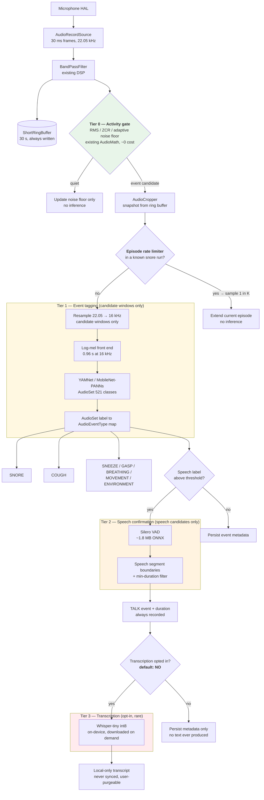

# Neural Audio Pipeline — Design

- **Status**: Proposed (design only; no code in this repo implements it yet)
- **Date**: 2026-08-09
- **Decision record**: [ADR-0007](adr/0007-tiered-neural-audio-pipeline.md)
- **Supersedes in scope**: the classification half of [§7 Audio Pipeline](architecture.md#7-audio-pipeline-detailed).
  Capture, ring-buffering, cropping, and encoding are **unchanged**.

---

## 1. Summary

Today, sleep-sound classification is a hand-rolled heuristic: `AudioFeatures` computes an 8-field
`FeatureVector` (RMS, ZCR, centroid, rolloff, flatness, pitch, periodicity, 13 band energies) and
`SpectralClassifier` applies four hard-coded threshold rules to pick `SNORE` / `COUGH` / `TALK` /
`NOISE`. It is fast, tiny, and fully testable — but it is a set of magic numbers tuned by hand, it
cannot express "this sounds like a cough *and* not like a door", and it has no path to improvement
short of editing thresholds.

This document evaluates the proposed replacement:

```
Raw Audio → DeepFilterNet3 (or RNNoise) → pyannote VAD → AST / PANNs classifier
                                                          ├─ Snore
                                                          ├─ Cough
                                                          └─ Other sleep sounds
                                                             ↓
                                          Whisper (speech segments only) → Sleep-talking detection
```

**Verdict: the stage decomposition is right, the topology and the model choices are not.** Adopted
literally on Android it would (a) throw away snoring and coughing before they reach the classifier,
(b) burn multiple hours of sustained single-core CPU per night, (c) grow the APK from 3.38 MB to
~400 MB, and (d) create an overnight bedroom-speech transcript that contradicts the app's central
privacy promise.

We keep the intent — **learned models instead of thresholds, and a separate speech path** — and
restructure it into a **tiered cascade** where each tier only runs on what the tier below it flagged.

---

## 2. What the proposed pipeline gets right

These are genuine improvements over the status quo and the revised design preserves all of them:

| Idea | Why it's right |
|---|---|
| **Denoise before analysis** | Bedroom noise floors vary hugely (fan, AC, traffic, partner). `BandPassFilter` + an adaptive noise floor in `VoiceActivityDetector` only partly compensate. |
| **Explicit segmentation stage** | The current design commits an event on an 800 ms silence gap — a crude boundary detector. A learned segmenter gives calibrated speech/non-speech boundaries. |
| **Learned event classifier** | AudioSet-pretrained models already know `Snoring`, `Cough`, `Sneeze`, `Breathing`, `Snort`, `Gasp`, `Speech` — a far richer and better-calibrated label set than four threshold rules. |
| **Separate, expensive speech path** | Correct instinct: ASR is orders of magnitude more expensive than tagging, so it must not run on every frame. |
| **Sleep-talking as a derived product** | Sleep talking is genuinely valuable and genuinely hard to detect from spectral features alone. |

---

## 3. Three problems with the literal topology

### P1 — VAD as a serial gate discards the primary targets

This is the critical flaw. In the diagram, everything downstream of the VAD is fed only by the VAD's
output. But `pyannote` VAD is a **speech** activity detector — it is trained to answer "is a human
speaking?", not "is anything happening?". Snoring is not speech. Coughing is not speech. Teeth
grinding is not speech.

Placed as a serial gate, pyannote VAD would suppress **snore and cough — the two headline outputs of
the very pipeline it sits in** — and pass through mostly sleep talking, which is the rarest event of
the three.

There is a second, subtler version of the same mistake: the current `VoiceActivityDetector` is
deliberately **observed, not applied** — `AudioPipeline` writes every frame to the ring buffer and
`AudioRecorderService` reads `lastIsVoice` as a *signal*. §7 calls this out explicitly ("VAD is
observed (not used to filter the chain) so the always-on ring buffer captures whole events even
across short silences"). The proposed topology regresses that hard-won property.

**Fix**: segmentation and speech detection are two different jobs.
- **Activity gate** (cheap, generic, energy/onset-based) decides *something is happening* → feeds the classifier.
- **Speech detector** (VAD) runs as a **branch fed by the classifier's `Speech` label**, not as a gate ahead of it.

### P2 — Continuous heavyweight inference is a battery and thermal non-starter

An 8-hour night is 28,800 seconds of audio. The relevant metric is **real-time factor** (RTF): CPU
seconds consumed per second of audio.

| Stage (literal design) | Plausible phone RTF | Sustained CPU per 8 h night |
|---|---|---|
| DeepFilterNet3 @ 48 kHz, continuous | ~0.15 – 0.30 | 1.2 – 2.4 h |
| pyannote segmentation, continuous | ~0.05 – 0.15 | 0.4 – 1.2 h |
| AST-base or PANNs-CNN14, continuous | ~0.10 – 0.40 | 0.8 – 3.2 h |
| **Total** | | **~2.4 – 6.8 h of full-core CPU** |

> RTFs are order-of-magnitude estimates for a mid-range ARM CPU and **must be benchmarked before any
> implementation commitment** (see §10). The conclusion — that continuous operation is untenable —
> holds across the whole plausible range, which is why it is safe to design against it now.

That is hours of sustained load on a device that is charging on a nightstand, next to a sleeping
person, in a phone that will thermally throttle and may audibly spin nothing but will get warm. It
also directly contradicts the repo's stated "Lighter App" goal ([§5](architecture.md#5-lighter-app-choices)),
where the entire justification for a hand-rolled FFT with pooled buffers is avoiding overnight GC
churn — a concern that is rounding error next to a 6-hour transformer workload.

**Fix**: tier the pipeline by duty cycle (§4). Expensive stages run on **candidate windows only**.

### P3 — Footprint and the privacy contract

**Footprint.** The release APK is **3.38 MB**, of which native libs are 0.06 MB — the app currently
bundles no DSP or ML runtime at all.

| Model (literal design) | Typical export size |
|---|---|
| DeepFilterNet3 | ~8 – 10 MB |
| pyannote segmentation-3.0 | ~6 MB (PyTorch; no official mobile export) |
| AST-base-384 | ~330 MB fp32 |
| Whisper-tiny | ~75 MB fp32 / ~40 MB int8 |
| **Total bundled** | **~380 – 425 MB** |

A >100× APK increase is not a trade-off; it is a different product. Additionally, `pyannote`
segmentation models are **gated on Hugging Face** (accept-conditions + access token) and ship as
PyTorch — there is no supported Android runtime path without an ONNX/ExecuTorch export you own and
maintain.

**Privacy.** This is the sharper problem. [ADR-0005](adr/0005-never-sync-raw-audio.md) commits to raw
audio never leaving the device, and the signal-only recorder mode (`ACTION_START_SIGNAL_ONLY`) goes
further — it early-returns before *any* encoding or Room write, so overnight staging retains **zero
audio**. The in-app privacy notice states this to users.

Whisper transforms overnight bedroom audio into **searchable, greppable, indefinitely-retained text**
— of the user, and of anyone else in the room who never consented. Speech that was previously
transient and unrecoverable becomes durable. A transcript is arguably *more* sensitive than the
waveform it came from, because it is trivially searchable.

**Fix**: the speech branch is opt-in, default-off, on-device-only, and by default emits only
**metadata** (episode count, timing, duration, confidence) — never text. Transcript retention is a
separate, explicitly-consented sub-toggle. See §8.

---

## 4. Revised architecture: a tiered cascade

Each tier runs only on what the previous tier flagged. Tier 0 is always on and effectively free;
Tier 3 may run a handful of times a night, or never.



### Duty cycle and cost

| Tier | Runs on | Typical share of an 8 h night | Model | Cost |
|---|---|---|---|---|
| **0 — Activity gate** | Every 30 ms frame | 100% | none (existing DSP) | negligible; already paid today |
| **1 — Event tagging** | Cropped candidate windows | 3 – 10% typical | YAMNet (~4 MB) | ~10 – 30 ms per 0.96 s window |
| **2 — Speech confirm** | Windows tagged `Speech` | < 1% | Silero VAD (~1.8 MB) | ~1 – 3 ms per 30 ms chunk |
| **3 — Transcription** | Confirmed speech, **if opted in** | ~0% (most nights: never) | Whisper-tiny int8 (~40 MB) | seconds per episode |

**Worst case is a habitual snorer**, who can be acoustically active for 30–50% of the night. Without
mitigation the gate stops helping. Hence the **episode rate limiter**: once *N* consecutive windows
classify as `SNORE` with high confidence, the pipeline declares a snore *episode* and drops to
classifying 1 window in *K* (e.g. 1 in 10) until two consecutive windows fall below the activity
threshold. Snore episodes are inherently periodic and homogeneous — per-window classification of the
400th consecutive snore adds no information. This bounds Tier-1 work to roughly a constant fraction
of the night regardless of sleeper phenotype, and it is the single most important cost control in the
design.

---

## 5. Model selection

### 5.1 Stage-by-stage

| Stage | Proposed | **Recommended** | Size | License | Rationale |
|---|---|---|---|---|---|
| Denoise | DeepFilterNet3 / RNNoise | **Defer** — keep `BandPassFilter`; revisit RNNoise only if Tier-1 accuracy demands it | 0 / ~0.1 MB | BSD-3 (RNNoise) | See §5.2 — denoisers are *speech-optimised* and can attenuate the non-speech events we care about. |
| Segment / VAD | pyannote | **Silero VAD** | ~1.8 MB | MIT | ONNX, edge-designed, 30 ms chunks, no gated download, no token. `pyannote` is PyTorch + gated + has no supported mobile path. |
| Event tagging | AST / PANNs-CNN14 | **YAMNet** (MobileNetV1, AudioSet 521) | ~4 MB | Apache-2.0 | ~90× smaller than AST-base and its class map **natively contains every label we need** — `Snoring` (38), `Cough` (42), `Sneeze` (44), `Breathing` (36), `Gasp` (39), `Snort` (41), `Speech` (0) — plus `Mechanical fan` (406) / `Air conditioning` (407) as confounders (§5.3). Ships as TFLite with a Task-Library classifier. **MobileNet-PANNs** is the fallback if YAMNet under-performs on snore. |
| ASR | Whisper Small / Turbo | **Whisper-tiny.en int8**, downloaded on demand, opt-in | ~40 MB | MIT | `small` is 244 M params (~2 GB VRAM) and `turbo` 809 M (~6 GB) — undeployable in an all-night foreground service. Sleep talk fails *acoustically*, not linguistically, so a bigger decoder does not rescue it (§5.3, §9). |

> Sizes are typical export/quantisation figures and vary by toolchain. **Measure the actual artefacts
> before committing to a delivery mechanism**, since the download-vs-bundle decision (§6) depends on them.

### 5.2 Why the denoiser is deferred, not adopted

DeepFilterNet3 and RNNoise are trained with a **speech** target: they learn to preserve speech and
suppress everything else. Snoring, coughing, and body movement are, from the model's point of view,
exactly the "everything else" it was trained to remove.

Running a speech enhancer ahead of a snore classifier risks systematically attenuating the primary
signal. This is not certain — snoring is loud, harmonic, and low-frequency, so it may survive — but
it is a real and asymmetric risk, and it costs the most expensive continuous stage in the pipeline
to take on.

**Decision**: keep the existing `BandPassFilter` for Tier 0. If Tier-1 evaluation shows noise-driven
errors, revisit with RNNoise (~0.1 MB, BSD-3, ~0.02 RTF) — and evaluate it **as a Tier-1 pre-step on
candidate windows only**, never as a continuous stage. AudioSet-pretrained taggers are already
trained on noisy in-the-wild YouTube audio; they are considerably more noise-robust than the
threshold rules they replace, which weakens the case for denoising at all.

§5.3 adds a second, stronger reason: YAMNet can **label** fan and AC noise rather than remove it.

### 5.3 Reconciliation with the task-by-task model survey

A per-task "best model" survey was raised separately, recommending pyannote VAD, PANNs-CNN14 for
cough, snore-fine-tuned AST, Whisper Small/Turbo, and RNNoise / DeepFilterNet3 — while its final row
notes that **edge/mobile deployment means Silero VAD + RNNoise**.

That last row is the whole argument. The survey ranks models on *accuracy in a server-side setting*;
this app has **no server-side setting for audio**. [ADR-0005](adr/0005-never-sync-raw-audio.md) makes
uploading audio impossible by design, so every model must run in a foreground service on a phone
overnight. Read through that constraint, the survey's own mobile row is the only row that applies to
the always-on path.

| Task | Survey pick | This design | Why the delta |
|---|---|---|---|
| VAD | pyannote | **Silero VAD**, and as a *branch*, not a gate | Not a quality dispute — pyannote is likely the better VAD. But it is PyTorch, gated on Hugging Face, with no supported Android runtime, and the survey's own edge/mobile row already concedes Silero. Separately, **placement** is the bigger issue (§3, P1): any speech VAD used as a serial gate drops snore and cough regardless of its quality. |
| General tagging | YAMNet ("good baseline") | **YAMNet as the primary**, not a baseline | See below — it already covers every class the other rows ask for. |
| Cough | PANNs-CNN14 or fine-tuned AST | **YAMNet class 42** | `Cough` is a native AudioSet class. |
| Snore | AST fine-tuned on snore datasets | **YAMNet class 38** | `Snoring` is a native AudioSet class. "Fine-tuned on snore datasets" also hides a training pipeline, a dataset licence, and a DUA lead time (cf. backlog #1, ~4 weeks for SHHS) behind two words. |
| Sleep talking | pyannote + Whisper Small/Turbo | **Silero + Whisper-tiny.en**, opt-in | Sizing, below. |
| Noise reduction | RNNoise / DeepFilterNet3 | **Defer; label instead of remove** | §5.2 plus the fan/AC finding below. |

#### One model already covers every row

The decisive fact, verified against the published
[YAMNet class map](https://github.com/tensorflow/models/blob/master/research/audioset/yamnet/yamnet_class_map.csv):
a single YAMNet forward pass emits **all** of the sleep-relevant classes the survey spreads across
three separate backbones.

| Class | Index | Class | Index |
|---|---|---|---|
| Speech | 0 | Snort | 41 |
| Whispering | 12 | **Cough** | **42** |
| Breathing | 36 | Throat clearing | 43 |
| Wheeze | 37 | **Sneeze** | **44** |
| **Snoring** | **38** | Sniff | 45 |
| Gasp | 39 | Silence | 494 |
| Pant | 40 | | |

Adopting AST for snore *and* CNN14 for cough *and* YAMNet for general tagging means shipping
~630 MB and paying three forward passes to obtain labels that **one ~4 MB model already produces in a
single pass**. On a phone that is not a quality/size trade-off; it is redundant work.

#### Detect the fan, don't remove it

YAMNet also has dedicated classes for exactly the noise sources the survey wants a denoiser for:
**`Mechanical fan` (406)**, **`Air conditioning` (407)**, and **`Mains hum` (510)** — plus
`Television` (518), `Radio` (519), and `Music` (132), which are precisely what today's
`SpectralClassifier` TALK rule misfires on.

This reframes the noise problem. Rather than spending the pipeline's most expensive continuous stage
attenuating fan noise — at the risk of attenuating snore with it (§5.2) — the classifier can simply
**recognise** fan/AC/hum as its own labels and use them for confounder rejection and room context.
Steady-state hum is the *easy* case for a learned tagger, and it is already handled upstream by
`BandPassFilter` plus the adaptive noise floor in `VoiceActivityDetector`.

#### Whisper Small/Turbo is not deployable here

From the [official model table](https://github.com/openai/whisper#available-models-and-languages):

| Model | Parameters | Required VRAM (reference impl.) | vs `tiny` |
|---|---|---|---|
| `tiny` | 39 M | ~1 GB | 1× |
| `base` | 74 M | ~1 GB | 1.9× |
| **`small`** | **244 M** | **~2 GB** | 6.3× |
| **`turbo`** | **809 M** | **~6 GB** | 20.7× |

`turbo` is an optimised `large-v3`. The VRAM column describes the reference PyTorch implementation,
not a quantised `whisper.cpp` build, so it overstates the on-device requirement — but the parameter
counts do not move: int8-quantised, `turbo` is still ~800 MB of weights and `small` ~240 MB, against
~40 MB for `tiny.en`. Against a 3.38 MB APK, in a process that must survive an entire night without
being killed by an OEM memory manager, neither is deployable.

Two further points cut against the upgrade. First, OpenAI notes the `.en` models "tend to perform
better, especially for the `tiny.en` and `base.en` models" — so an English-only sleep-talk use case
recovers part of the gap for free. Second, and more important: the sleep-talk failure mode is
**acoustic, not linguistic**. Speech that is slurred, mumbled, low-amplitude, and captured metres
away is degraded before it reaches the decoder; a larger language decoder does not reconstruct
information the microphone never captured. It mostly makes the model *more fluent at guessing*, which
is the worst possible property for a bedroom transcript.

If Phase-4 WER measurement shows `tiny.en` is inadequate, the honest conclusion is **ship
detection-only** (§8, backlog #30), not escalate to a 809 M-parameter model.

### 5.4 Tiering is not an accuracy compromise — and where the heavy stack *does* belong

The strongest form of the survey's argument is: *this combination gives the best accuracy, and it is
still practical to run locally on a PC or a modern phone.* Both halves deserve a direct answer.

**On accuracy.** Tiering does not degrade it, because the tiers do not change *what model sees a
given sound* — only *how many times a model is asked about silence*. Running AST across all 28,800 s
of a night and running it only on the ~1,500 s that contain sound produce the **same labels for the
same events**; the remaining ~27,300 s are correctly labelled "nothing happened" either way. The
linear pipeline is not more accurate. It is the same accuracy at roughly 20× the compute.

**The one place that argument is genuinely vulnerable** is Tier-0 recall. A gate that misses a quiet
event denies every downstream tier the chance to classify it, and no amount of downstream model
quality recovers it. This is a real, asymmetric risk and the design must treat it as the primary
failure mode: **Tier 0 is tuned for high recall and low precision** — it should pass anything
remotely plausible and let YAMNet reject it, because a Tier-1 false positive costs ~20 ms while a
Tier-0 false negative costs the event. Backlog #27's labelled evaluation set exists to measure
exactly this, and Tier-0 recall should be an explicit acceptance criterion, not an afterthought.

**On "practical on a modern phone."** For a clip, absolutely — a current SoC will run AST or
DeepFilterNet3 on a few seconds of audio without difficulty. The claim does not survive the word
*continuous*: the constraint here is not peak capability but **sustained operation for 28,800
consecutive seconds, on battery, in a foreground service that must not be killed, while the user is
asleep and cannot intervene**. Phones thermally throttle; OEM memory managers reap long-lived
services; and a tracker that returns a beautiful hypnogram alongside a 40%-flat battery has failed at
its actual job.

There is a fair objection: **many users charge overnight**, which largely removes the battery
constraint. Granted — but that is an argument for *when* to run the heavy models, not for running
them continuously. Charging removes the energy budget; it does not remove thermal throttling (a
charging phone runs hotter), and it does not make continuous inference produce better labels than
gated inference.

Both observations point the same way, and they yield a genuinely useful addition to this design.

#### Tier 4 — offline deep pass (opt-in, on charger, after the session)

The survey's own wording scopes DeepFilterNet3 to *"offline processing"*. That is the correct
reading, and this app has a natural offline stage the original topology did not exploit: retained
event clips already exist as `AudioRecording` rows after the session ends.

| | Always-on path (Tiers 0–3) | **Tier 4 — deep pass** |
|---|---|---|
| When | During the session, in real time | After wake, **only while charging**, WorkManager-scheduled |
| Input | Live 30 ms frames | Retained clips from the night (seconds to a few minutes total) |
| Models | Tier-0 DSP → YAMNet → Silero → `tiny.en` | **DeepFilterNet3 → AST / PANNs-CNN14**, and a larger Whisper if the user opted into transcripts |
| Budget | Must be near-free | Minutes of compute on mains power is entirely acceptable |
| Purpose | Live labels, real-time signals, smart-wake input | Re-score and correct the night's labels at higher accuracy |

This is where the survey's stack is not merely affordable but *right*. Constraints that make DFN3 and
AST untenable in the always-on path — RTF, thermals, battery — mostly evaporate when the work is
batched, bounded, and mains-powered. A deep pass can legitimately re-label a night's events with a
heavier backbone, and disagreements between Tier 1 and Tier 4 are exactly the labelled training
signal backlog #27 wants.

Three constraints keep it honest:

1. **It cannot rescue Tier-0 recall.** A deep pass only sees what was retained. Storing the whole
   night is not an option: 22 050 Hz × 16-bit mono × 8 h ≈ **1.27 GB per night**, which is
   unacceptable on both storage and privacy grounds — it would convert a tracker that keeps seconds
   of audio into one that keeps a complete recording of a bedroom. Tier-0 recall therefore remains
   the ceiling for the whole system, in every architecture.
2. **Models stay on-demand.** DFN3 + AST is a further ~350 MB. It must be an explicit opt-in
   download for users who want maximum accuracy, never bundled, and never a prerequisite for the
   core feature.
3. **Privacy posture is unchanged.** Signal-only mode retains nothing, so it has no Tier 4 at all —
   correctly. A larger Whisper here is still bound by §8: opt-in, on-device, local-only, purgeable,
   and excluded from sync by document shape.

Tier 4 is deliberately **not** in the Phase 0–5 rollout (§10). It is a legitimate follow-up
(backlog **#31**) that should be evaluated only once #27 has produced measurements — its entire
justification is "the heavy models are worth their cost *here*", and that is a claim to verify, not
assume.

---

## 6. Model delivery and footprint

Bundling ~46 MB (YAMNet + Silero + Whisper) into a 3.38 MB APK is a 14× increase for features most
users will not enable.

| Model | Delivery | Trigger |
|---|---|---|
| YAMNet (~4 MB) | **Play Feature Delivery — on-demand module**, or `DownloadManager` + integrity check | First time neural classification is enabled |
| Silero VAD (~1.8 MB) | Same module as YAMNet | With YAMNet |
| Whisper-tiny (~40 MB) | **Separate on-demand module** | Only when the user opts into transcription |

Base APK stays at ~3.4 MB. Requirements: SHA-256 verification of every downloaded artefact,
Wi-Fi-only default, resumable download, graceful fallback to `SpectralClassifier` when models are
absent or a download fails, and user-visible storage accounting with a "remove downloaded models"
action.

---

## 7. Integration with the existing code

The good news: [ADR-0001](adr/0001-strategy-factory-for-sleep-stage-estimators.md)'s Strategy +
Factory shape was built for exactly this, and `ClassifierFactory` already anticipates it in a comment
— *"once a TFLite model is bundled, the factory can read user prefs / device capabilities and pick
MlClassifier without touching callers."*

### 7.1 What must change

**`AudioClassifier` cannot express a neural classifier.** It is `classify(FeatureVector) → ClassificationResult`,
and a `FeatureVector` is 8 scalars plus 13 band energies — lossy, irreversible, and nothing like the
64×96 log-mel patch YAMNet needs. Widen the abstraction rather than distorting `FeatureVector`:

```kotlin
// New — neural classifiers need the waveform, not a summary of it.
interface PcmClassifier {
    fun classify(pcm: ShortArray, offset: Int, length: Int, sampleRateHz: Int): ClassificationResult
    fun close()
}
```

`SpectralClassifier` keeps implementing `AudioClassifier` unchanged. `NeuralAudioClassifier`
implements `PcmClassifier`. `AudioRecorderService` already holds the cropped PCM at classification
time, so the call site has what it needs without re-plumbing the pipeline.

| Component | Change |
|---|---|
| `ClassifierFactory` | Add `Backend.NEURAL`; select on user pref **and** model-availability **and** device capability, falling back to `SPECTRAL`. |
| **Resampler** (new) | `Constants.AUDIO_SAMPLE_RATE` is **22 050 Hz**, but YAMNet and Silero VAD both expect **16 kHz**. 16000/22050 is not an integer ratio, so a proper polyphase/windowed-sinc resample is required — run it **per candidate window inside Tier 1**, never on the full stream. Nothing is lost: `AudioMath.melBandEnergies` already caps its top band at 8 kHz, which is exactly Nyquist at 16 kHz. Do **not** change the capture rate — every existing `SpectralClassifier` threshold, `BandPassFilter` coefficient, and `VoiceProfileBuilder` profile is calibrated at 22 050 Hz. |
| `AudioEventType` | Add `SNEEZE`, `GASP`, `BREATHING`, `MOVEMENT`, `ENVIRONMENT`. Safe: persisted as a string `key`, and `fromKey` already falls back to `UNKNOWN`. **No Room migration** — `AudioRecording.type` is a `String`. |
| `AudioRecording` | Add nullable `classifierBackend: String?` and `modelVersion: String?` so results are attributable to the model that produced them, and A/B comparison is possible. **Requires a Room migration** (additive, nullable). |
| `AppPreferences` | `NEURAL_CLASSIFIER_ENABLED`, `SLEEP_TALK_DETECTION_ENABLED`, `SLEEP_TALK_TRANSCRIPTS_ENABLED` — all `booleanPreferencesKey`, all default `false`. |
| `ServiceLocator` | Own the interpreter lifecycle as a lazy singleton; interpreters are expensive to create and **must not** be per-event. |
| `AudioRecorderService` | Route to `PcmClassifier` when the factory returns `NEURAL`; own the episode rate limiter. |

### 7.2 What does *not* change

`AudioRecordSource`, `AudioPipeline`, `BandPassFilter`, `ShortRingBuffer`, `AudioCropper`,
`PcmEncoder`, `FftProcessor`, `VoiceMatcher`, and the entire `audio/analysis/` mic-staging path
(`BreathingExtractor`, `MovementBurstDetector`, `MicSleepSignalAggregator`) are untouched. Mic-based
sleep staging continues to run on DSP features and stays available in signal-only mode with **zero
model downloads**, so [§7c](architecture.md#7c-microphone-based-sleep-stage-prediction) degrades
exactly as it does today.

Critically, **the signal-only recorder path never reaches Tier 1**: staging needs breathing envelope
and movement bursts, not event labels. Zero-retention overnight staging keeps working with no
inference at all.

### 7.3 Threading and memory

- Inference runs on `AudioDispatchers.processing`, never on the capture thread — Tier-1 latency
  spikes must not cause `AudioRecord` overruns.
- **One** interpreter instance, created lazily, guarded for single-threaded access (TFLite
  interpreters are not thread-safe). Reuse input/output tensors across invocations, in the same
  spirit as [ADR-0006](adr/0006-pooled-fft-buffers-in-the-audio-pipeline.md)'s buffer pooling — a
  per-event `Interpreter` allocation would reintroduce exactly the GC churn that ADR eliminated.
- Release the interpreter in `onDestroy`; never hold it across a service restart.
- NNAPI/GPU delegates are **opt-in after benchmarking only**. Delegate initialisation can cost more
  than it saves for short, infrequent invocations, and NNAPI behaviour is notoriously
  device-dependent. CPU with 2 threads is the default.

---

## 8. Privacy design for the speech branch

This is the part of the proposal that most needs an explicit stance, because it is where the app's
existing promises are easiest to break by accident.

**Principles**

1. **Detection ≠ transcription.** "You talked in your sleep for 12 seconds at 03:41" is the feature
   users actually want. It requires Tier 2 only. Text is a separate, much more sensitive product.
2. **Default off, twice.** Sleep-talk *detection* is opt-in. Transcript *retention* is a second,
   independent opt-in that cannot be enabled without the first.
3. **On-device only, always.** Whisper runs locally. Transcripts are `AudioEventType.TALK` metadata
   plus local text; they are **excluded from `SyncRepository` payloads unconditionally** — not by a
   settings check, but by never being in the uploaded document shape. This extends
   [ADR-0005](adr/0005-never-sync-raw-audio.md): *derived text from audio is treated as raw audio.*
4. **Bystander consent is unobtainable.** A partner never agreed to this. Default-off is the only
   defensible posture, and the consent copy must say plainly that others in the room may be recorded.
5. **Aggressive retention limits.** Transcripts auto-purge on a short default window (e.g. 7 days),
   with one-tap "delete all transcripts" in Settings and inclusion in the existing data-deletion flow.
6. **Signal-only mode stays absolute.** `ACTION_START_SIGNAL_ONLY` retains nothing, produces no
   transcripts, and downloads no ASR model — no exceptions.

**Consent copy must state**: what is recorded, that it stays on the device, that it is never uploaded,
how long it is kept, how to delete it, and that other people in the room may be captured.

---

## 9. Accuracy expectations

In keeping with [§7c.6](architecture.md#7c6-honest-accuracy-expectations)'s honesty about the mic
estimator, the expected wins are uneven:

| Event | Today (`SpectralClassifier`) | Expected with Tier 1 | Confidence |
|---|---|---|---|
| Snore | Decent — loud, periodic, low-pitched; the rules genuinely fit | **Moderate gain**, mostly in *precision* (fewer fan/AC false positives) | High |
| Cough | Weak — a `peak > 18000` threshold conflates coughs with door slams | **Large gain** | High |
| Sneeze / gasp / snort | Not detected at all | **New capability** | High |
| Talk | Weak — pitch-range heuristic misfires on TV, music, partner | **Large gain** — `Television` (518), `Radio` (519), and `Music` (132) are distinct YAMNet classes, so the main confounders become explicit labels rather than false positives; Tier 2 adds real segment boundaries | High |
| Sleep-talk transcription | N/A | **Poor to fair** — expect high WER | **Low** |

The sleep-talk caveat is important and should reach the UI: sleep speech is slurred, mumbled,
low-amplitude, often unintelligible even to a human listener, and recorded metres from the mic. ASR
trained on clear read speech degrades badly here. **Present transcripts as unreliable, or ship
detection-only until measured WER justifies otherwise.** A confidently-wrong transcript of what
someone said in bed is a worse outcome than no transcript.

### Evaluation plan

Before any rollout:

1. **Benchmark harness** — measure real RTF, peak memory, and per-invocation latency for each
   candidate model on low-end, mid-range, and flagship devices. §3's RTF table is an estimate; this
   replaces it with data.
2. **Labelled evaluation set** — 20–30 nights with human-verified event labels. Report per-class
   precision/recall against `SpectralClassifier` as the baseline. A neural model that wins on
   accuracy but loses on precision for snore is not an improvement, because snore drives the score.
3. **Overnight battery A/B** — full-night runs with the neural path on and off, measuring battery
   delta and peak device temperature. Hard gate: **< 3% additional battery per night**.
4. **Rate-limiter validation** — verify on snore-heavy nights that Tier-1 invocation count stays
   bounded (§4).

---

## 10. Phased rollout

| Phase | Deliverable | Gate to proceed |
|---|---|---|
| **0** | Benchmark harness + labelled eval set | Real RTF/latency/memory numbers exist |
| **1** | `PcmClassifier` interface, `Backend.NEURAL`, YAMNet behind a default-off flag, on-demand delivery, fallback to `SpectralClassifier` | Beats baseline on cough/talk precision-recall; battery delta < 3% |
| **2** | New `AudioEventType`s + Room migration + UI surfacing; episode rate limiter | Rate limiter holds on snore-heavy nights |
| **3** | Silero VAD (Tier 2) + sleep-talk **detection** (metadata only, opt-in) | Segment boundaries validated against labels |
| **4** | Whisper transcription (Tier 3), separate opt-in, retention limits, purge UI | Measured WER is good enough to be honest about; privacy review signed off |
| **5** | Revisit RNNoise as a Tier-1 pre-step | Only if Phase 1–3 show noise-driven errors |

Each phase is independently shippable and independently revertible; `ClassifierFactory` falls back to
`SPECTRAL` at every phase boundary.

---

## 11. Risks

| Risk | Impact | Mitigation |
|---|---|---|
| Denoiser attenuates snore/cough | Core feature regresses | Denoiser deferred entirely (§5.2); if revisited, evaluated on candidate windows with before/after recall |
| Snore-heavy nights defeat the activity gate | Battery blowout | Episode rate limiter (§4); Phase-2 gate |
| YAMNet under-performs on snore vs the tuned heuristic | No net win | Baseline comparison in Phase 1; MobileNet-PANNs fallback; `SPECTRAL` remains selectable |
| Model download fails / user declines | Feature unavailable | `SpectralClassifier` is always the fallback; **no feature ever hard-depends on a downloaded model** |
| Transcripts leak into cloud sync | Breaks ADR-0005 in spirit and letter | Excluded by document *shape*, not by a settings check; add a sync-payload unit test asserting no transcript field |
| APK/storage bloat | Contradicts "lighter app" | On-demand delivery; base APK unchanged; storage accounting + removal UI |
| NNAPI delegate device fragmentation | Crashes / wrong results on specific OEMs | CPU default; delegates opt-in post-benchmark with per-device allowlist |
| Interpreter lifecycle bugs | Native leaks over 8 h | Single lazy instance in `ServiceLocator`; `close()` in `onDestroy`; leak test over a simulated long session |

---

## 12. Open questions

1. **Detection-only, permanently?** If measured sleep-talk WER is poor (likely), is transcription
   worth shipping at all, or is "you talked for 12 s at 03:41" the whole feature?
2. **Minimum device tier.** Do we gate the neural path on RAM/SoC class, or let the benchmark decide
   per-device at runtime?
3. **Does `VoiceMatcher` move to embeddings?** A learned speaker embedding would outperform the
   current feature-distance matcher for "who's snoring?", but adds another model. Out of scope here;
   worth a follow-up.
4. **On-device personalisation.** Per-user threshold calibration from user corrections ("this wasn't
   a cough") is cheap and probably beats a bigger model. Worth a follow-up.
5. **Does Tier 1 improve *staging*?** Better snore/breathing labels could feed `MicSleepSignalAggregator`
   and improve `MicSleepStageEstimator` — untested, but a plausible second-order win.

---

## References

- [ADR-0007 — Tiered neural audio pipeline](adr/0007-tiered-neural-audio-pipeline.md) (the decision record)
- [ADR-0001 — Strategy + Factory for sleep-stage estimators](adr/0001-strategy-factory-for-sleep-stage-estimators.md)
- [ADR-0005 — Never sync raw audio](adr/0005-never-sync-raw-audio.md)
- [ADR-0006 — Pooled FFT buffers](adr/0006-pooled-fft-buffers-in-the-audio-pipeline.md)
- [architecture.md §7 — Audio Pipeline (Detailed)](architecture.md#7-audio-pipeline-detailed)
- [architecture.md §7c — Microphone-Based Sleep Stage Prediction](architecture.md#7c-microphone-based-sleep-stage-prediction)
- [backlog.md #27–#30](backlog.md) — the deferred work this design creates

**External sources cited in §5.3:**

- [YAMNet AudioSet class map](https://github.com/tensorflow/models/blob/master/research/audioset/yamnet/yamnet_class_map.csv) — source of the class indices quoted above (`Snoring` 38, `Cough` 42, `Mechanical fan` 406, …)
- [Whisper — available models and languages](https://github.com/openai/whisper#available-models-and-languages) — source of the parameter counts and VRAM figures
- [Silero VAD](https://github.com/snakers4/silero-vad) — MIT, ONNX, edge-targeted
- [RNNoise](https://jmvalin.ca/demo/rnnoise/) — BSD-3, retained as the deferred denoiser option
